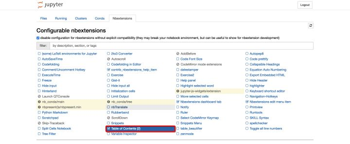
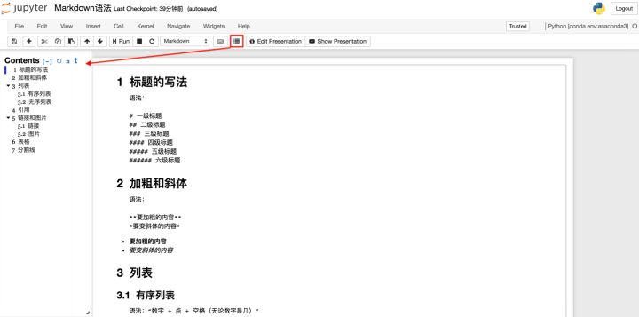

# conda常用命令

```bash
conda -V  #查看conda版本
conda update conda #更新至最新的版本，也会更新相关包

#查看环境管理的全部命令
conda env -h    

#显示所有已创建的环境
conda info -e
conda env list

 #切换至某个环境中
activate env_name

#新建环境
conda create --name your_env_name python=3.5
```

# pip常用命令

```bash
python -m pip install --upgrade pip
pip install packageName
pip uninstall packageName
```

# Jupyter Notebook/Lab

## 启动

```bash
#通过批处理脚本来启动jupyter lab
rem -- start_jupyter_notebook.bat ---

cd D:\PythonProgram\SentimentAnalysis

d:

call activate sentimentAnalysis
call jupyter lab
```

## 基本操作

- Jupyter Notebook有两种mode

- - Enter：进入edit模式;
  - Esc：进入command模式;
  - command模式下按"H"可以查看快捷键;


- 在Jupyter Notebook中的笔记本单元格中用英文感叹号“!”后接shell命令即可执行shell命令。

```bash
!shell命令
```


- 关联Jupyter Notebook和conda的环境和包——"nb_conda"

```bash
conda install nb_conda
```

## 常用扩展

- Jupyter Notebook无法为Markdown文档通过特定语法添加目录，因此需要通过安装扩展来实现目录的添加。

- - 安装对应扩展

```bash
conda install -c conda-forge jupyter_contrib_nbextensions
```

- 在 "Nbextensions"中勾选"Table of contents"

  

- 点击图标即可显示

  

- Jupyter Lab使用kite来完善代码补全的功能