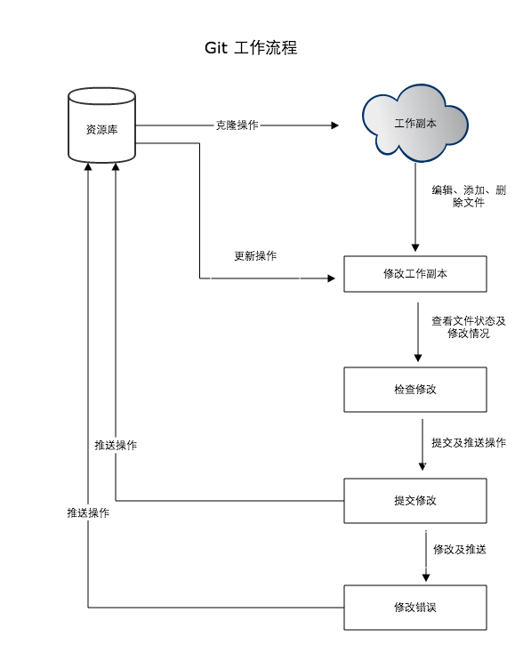
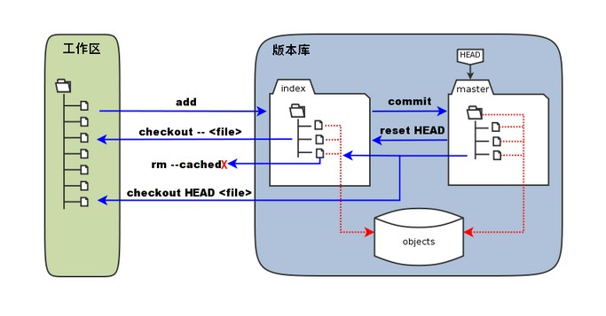
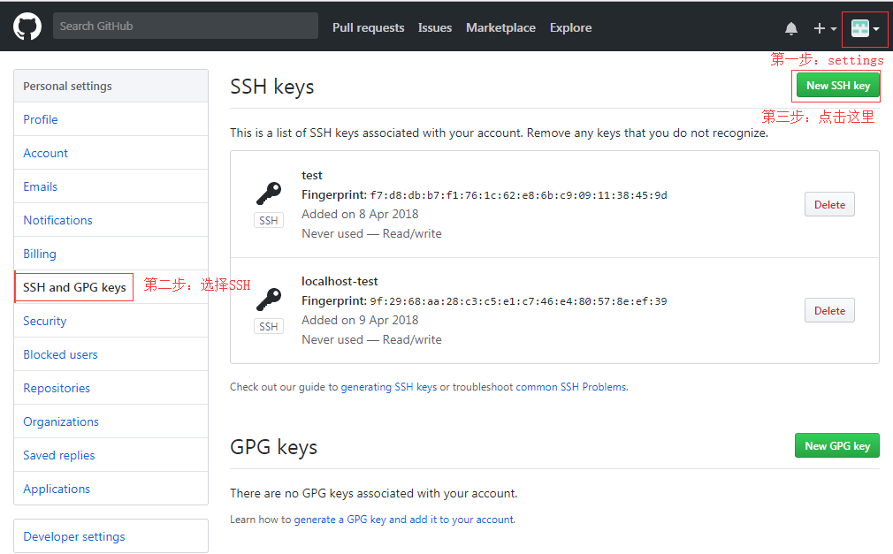

# 简介

Git是一个**开源的分布式版本管理**系统；

**查看git版本**

```bash
git --version
```

# Git配置

Git提供了一个叫做git config的工具，专门用来配置或读取相应工作环境变量；

- /etc/gitconfig 文件
- - 系统中对所有用户普遍适用的配置;
  - 使用gitconfig时用 --system 选项，读写的就是这个文件；
- ~/.gitconfig 文件
- - 用户目录下的配置文件只适用于该用户；
  - 若使用gitconfig时用 --global 选项，读写的就是这个文件;
- 当前项目的git中的配置文件（工作目录中的.git/config文件）
- - 这里的配置仅仅对当前项目有效；
  - 每一个级别的配置都会覆盖上层的相同配置；故.git/config里的配置会覆盖/etc/gitconfig中的同名变量；

## 用户信息

```bash
# 使用 -global 选项，更改的配置文件为用户目录下的，以后所有的项目都会默认使用这里的用户信息；
git config --global user.name "username"
git config --global user.email yourEmail@xxx.com

# 查看已有的配置信息
git config -list
```

# 工作流程

- **克隆Git**资源作为工作目录；
- 在克隆的资源上**添加或修改文件**；
- 其他人提交了修改，你可以**更新资源，**提交前查看修改**；**
- **提交修改；**
- 修改完成后，发现错误，**可以撤销提交并再次修改并提交**；



# Git结构



- 工作区：本地端的directory;
- 暂存区：英文叫stage或index。一般存放在 .git 目录下的index文件中，所以我们把暂存区有时候也叫索引（index）;
- 版本库：工作区有一个隐藏目录 .git 。不是工作区，而是Git的版本库；

# Git使用

## 创建仓库

- git 的配置
- git init
- git clone

配置

```bash
# git 的设置使用 git config 命令

# 显示当前的 git 配置信息
git config --list

# 编辑 git 配置文件
git config -e  # 针对当前仓库
git config -e --global # 针对系统上所有的仓库

# 设置提交代码时的用户信息
git config --global user.name "binlongzhang"
git config --global user.email 1094859023@qq.com

# 去掉 -global 参数只对当前仓库有效
```

**Init**

初始化一个Git仓库，初始化完成后Git仓库会生成一个.git目录，改目录包含了资源的所有元数据，其他的项目目录保持不变；

```bash
# 初始化当前目录为git仓库
git init

# 使用指定目录为Git仓库
git init newRepo

# 将当前文件夹下的以.c结尾的几个文件,以及README纳入版本控制
git add *.c
git add README
git commit -m "初始化项目版本"
```

**Clone**

从现有的Git仓库中拷贝项目（类似 svn 的 checkout）

```bash
# 克隆仓库
git clone <repo>

# 克隆仓库到指定目录
git clone <repo> <directory>

# example：
git clone git://github.com/schancon/grit.git
git clone git://github.com/schancon/grit.git mygrit
```

## 基本操作


| workspace | staging area  | local repository | remote repository |
| --------- | ------------- | ---------------- | ----------------- |
| 工作区    | 暂存区/缓冲区 | 或本地仓库       | 远程仓库          |

```bash
# 创建仓库命令
git init        # 初始化仓库
git clone       # 拷贝一份远程仓库,Download一个项目

# 提交和修改
git add .       # 添加文件到staging area
git status  # 查看 workspace 的当其状态，显示文件变更
git diff        # 比较staging area 和 workspace 的差异
git commit  # 将staging area的内容添加到local repository中
git reset   # 回退版本
git rm          # 删除 workspace
git mv          #   移动或重命名workspace的文件

# 提交日志
git log         #   查看历史提交记录
git blame <file>    # 以列表的形式查看指定文件的历史修改记录

# 远程操作
git remote  # remote repository 操作
git fetch   # 从remote repository 获取代码库
git pull        # Download远程代码并合并
git push        #上传远程代码并合并
```

## 忽略部分文件

```bash
touch .gitignore

# 修改.gitignore文件，规则如下

target          //忽略这个target目录
angular.json    //忽略这个angular.json文件
log/*           //忽略log下的所有文件
css/*.css       //忽略css目录下的.css文件
```

## 分支管理

```bash
# 列出分支,无参数时会列出本地分支
git branch
# 创建分支
git branch (branchname)
# 切换分支
git branch (branchname)
# 创建分支并立即转换到该分支下
git checkout -b (branchname)

# 删除分支
git branch -d (branchname)
# 分支合并，将分支合并到主分支
git merge (branchname)
# 合并产生的 conflict 需要手动修复，并且add,commit
git status -s
git add (filename)
git commit
```

## 提交日志

```bash
# 查看历史提交记录
git log
git log --oneline # 历史记录简介版本
git log --graph     # 以拓扑图的形式查看提交日志
git log --reverse # 逆向显示,与其他参数并用
git log --author=(authorName) # 查看指定作者的日志

git blame <file> # 查看指定文件的修改记录
```

关于 git log 的详细参数

https://git-scm.com/docs/git-log

## 标签

当项目到达一个重要阶段，希望永远标记这个提交快照，可以使用git tag 给他打上标签；

```bash
# 打上标签 v1.0,-a 会创建一个带注解的标签,会记录作者和时间
git tag -a v1.0 -m "版本1.0的标签"

# 查看所有标签
git tag
```

# Git关联Github

1. 注册并登陆一个Github账号并建立一个仓库；
2. 创建SSH key（ Git 和 Github之间通过 SSH加密）

- - 在本地目录中查找 .ssh目录，一般会有这两个文件：id_rsa 和 id_rsa.pub ；
  - 没有的话在命令行中输入

```bash
# 邮箱推荐和Github账号一致
ssh-keygen  -t rsa –C “youselfemail@email.com”
```

1. 登录github，右上角：设置→settings-SSH and GPR keys→New SSH key，然后输入你的标题，输入上面的公钥，然后点击保存。



1. 在github上创建仓库，然后进入创建的仓库Clone or Download;然后通过

```bash
# 通过该命令将本地仓库和Github仓库连接好
git remote add origin https://xxxxxxxxxxxxxx
```

## Git服务器的搭建

To be contine
