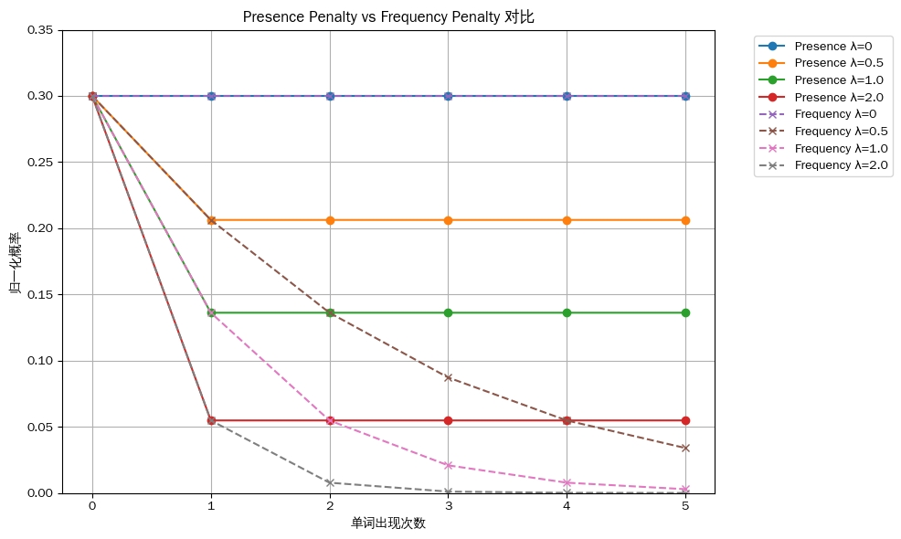
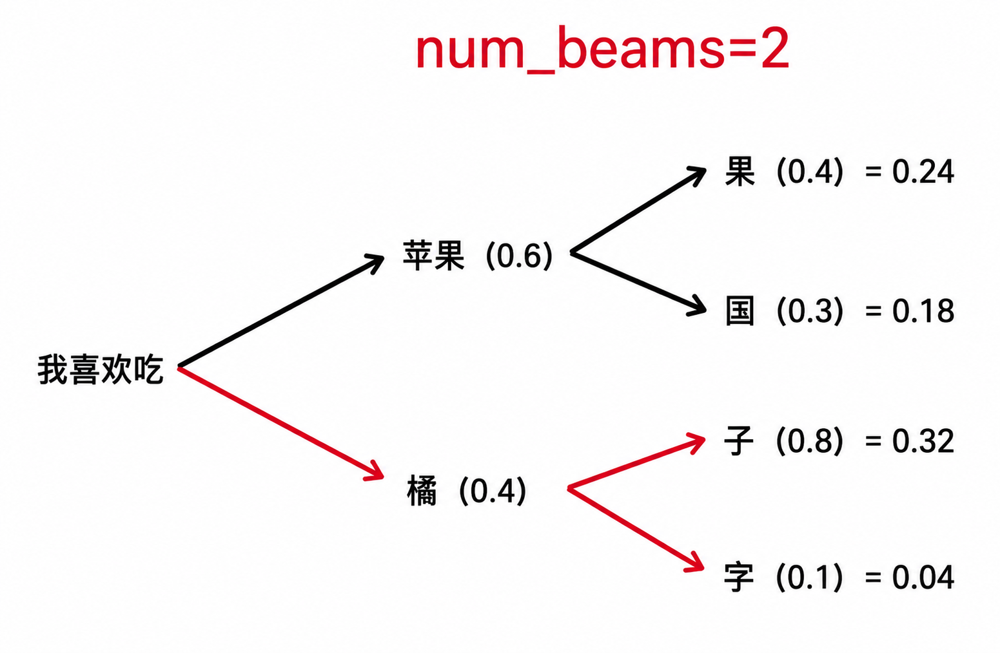
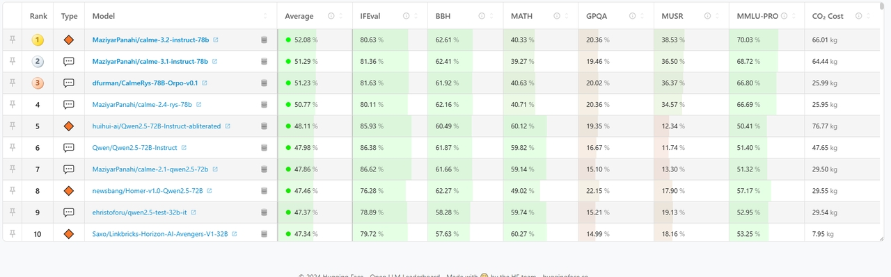
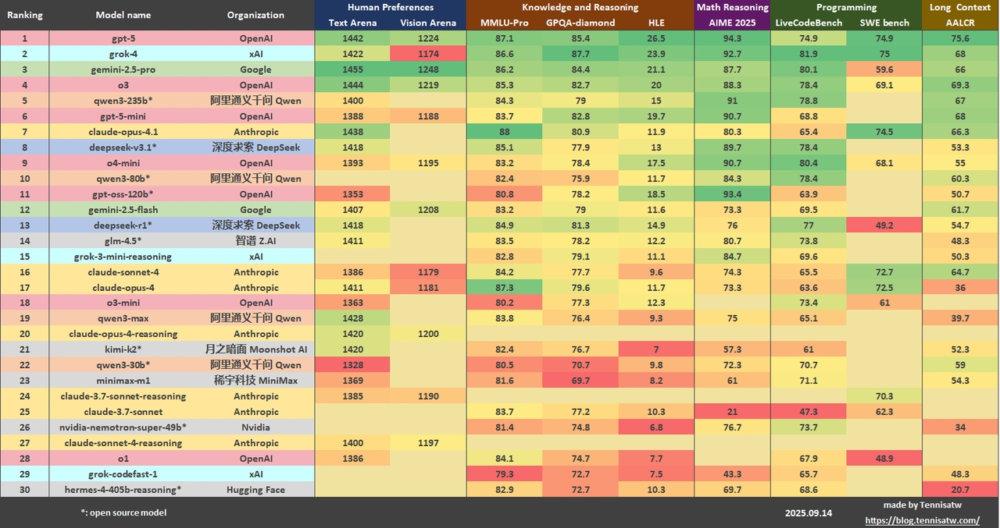
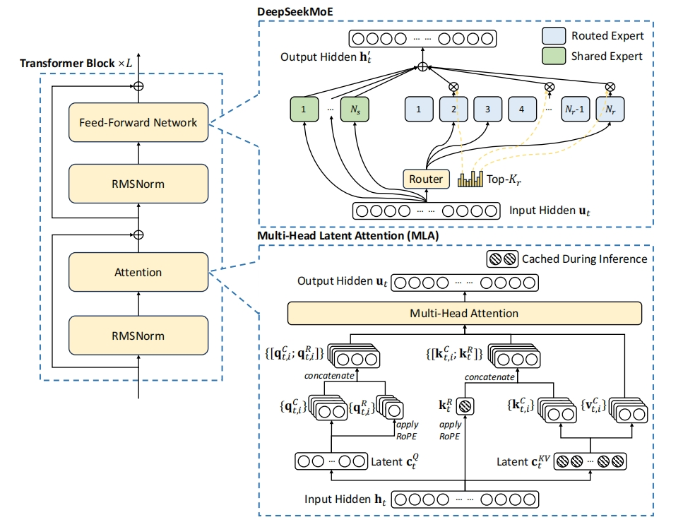
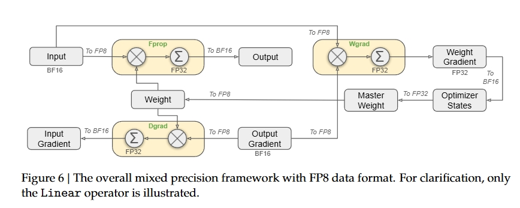

> AI时代无论从算法、工程、落地、还是应用的角度，都有必要对其有基本的了解
>
> 本文非常适合小白入门
    
# GPU   

>  Generate by AI，值观说清楚gpu和cpu的最大区别 

   

> gpu和cpu的简要结构图，由此可见二者特性差异 

   

通常来说   
- 主频:CPU>GPU   
- 计算单元:CPU<GPU   
   
> GPU的基础架构图
   
 
 此外，现代 GPU 还集成了多种 专用计算单元， 比如张量核心（Tensor Cores）、光线追踪单元（Ray Tracing Units） 以便在深度学习、图形渲染等特定场景下实现更高效的加速。

---

 这里简单列了几个常见典型GPU的性能，给大家直观感受GPU的特点     
| 指标 | Tesla V100 | A100 | H100 | H200 |
|------|------------|------|------|------|
| 架构 | Volta | Ampere | Hopper | Hopper 改进版 |
| 发布年份 | 2017 | 2020 | 2022 | 2024 |
| FP32性能 (TFLOPS) | 15.7 | 19.5 | 60 | 67 |
| 显存容量 | 16 GB / 32 GB | 40 GB / 80 GB | 80 GB | 141 GB |
| 显存类型 | HBM2 | HBM2e | HBM3 | HBM3e |
| 显存带宽 | 900 GB/s | 1.9 – 2.0 TB/s | 3.35 TB/s | 4.8 TB/s |
| 功耗 (TDP) | 300 W | 300 – 400 W | 700 W | 600 – 700 W |   

# LLM   
   
## 从文本到机器指令   

### Prompt Engineer    
>  所见非所得    

   
 服务层会内置部分Prompt **Adapter/Wrapper**    

>  部署时针对模型做的标签适配，很多时候api提供商(尤其针对开源)不一定能将其全部转义，因此设计Prompt时候应该尽量避免使用    
   

``` json
messages = [
    {"role": "system", "content": "You are DeepSeek"},
    {"role": "user", "content": "Who are you?"},
    {"role": "assistant", "content": "<think>Hmm</think>I am DeepSeek"},
    {"role": "user", "content": "hello world!"}
]
```

``` python
# 历史不带思维连
<｜begin▁of▁sentence｜>
You are Deepseek
<｜User｜>Who are you?
<｜Assistant｜></think>I am DeepSeek
<｜end▁of▁sentence｜>

# 思考模式
<｜User｜>hello world!
<｜Assistant｜><think>

# 非思考模式
<｜User｜>hello world!
<｜Assistant｜></think>
```
### Tokenization    

>  Byte Pair Encoding (目前LLM最常用)  Y. Shibata, T. Kida, S. Fukamachi, M. Takeda, A. Shinohara, T. Shinohara, and S. Arikawa. Byte pair encoding: A text compression scheme that accelerates pattern matching. 1999.    
   

``` shell
# tiktoken:a fast open-source tokenizer by OpenAI

Example string: "antidisestablishmentarianism"
r50k_base: 5 tokens
token integers: [415, 29207, 44390, 3699, 1042]
token bytes: [b'ant', b'idis', b'establishment', b'arian', b'ism']

Example string: "2 + 2 = 4"
r50k_base: 5 tokens
token integers: [17, 1343, 362, 796, 604]
token bytes: [b'2', b' +', b' 2', b' =', b' 4']


Example string: "你好"
r50k_base: 4 tokens
token integers: [19526, 254, 25001, 121]
token bytes: [b'\xe4\xbd', b'\xa0', b'\xe5\xa5', b'\xbd']
```

``` shell
# google sentencepiece

原句: hello worldwide
BPE分词: ['▁', 'he', 'll', 'o', '▁', 'w', 'o', 'r', 'l', 'd', 'w', 'i', 'd', 'e']
Unigram分词: ['▁hello', '▁world', 'w', 'i', 'd', 'e']

原句: 天气预报说今天天气不错
BPE分词: ['▁天气预', '报说', '今', '天', '天气', '不错']
Unigram分词: ['▁', '天气', '预', '报', '说', '今', '天', '天气', '不', '错']
```

``` python
# Qwen tokenizer 
from transformers import AutoTokenizer

tokenizer = AutoTokenizer.from_pretrained('Qwen/Qwen-7B', trust_remote_code=True)

>>> tokenizer.tokenize("Panda")
[b'P', b'anda']

>>> tokenizer.tokenize(" Panda")
[b' Panda']

>>> tokenizer.tokenize("Pandas")
[b'P', b'andas']

>>> tokenizer.tokenize(" Pandas")
[b' Pand', b'as']
```

### Embedding

>  注意：LLM识别的token是有限的，例如 deepseekv3词汇表是129280,Qwen3是151669    
   
从token->向量 注意区分embedding模型和embedding层   
- Embedding 模型 （学好普通话）   
    - Word2Vec、GloVe、FastText: 专注于训练各token的通用表征/含义   
- LLM Embedding层 （只要能理解，方言也够用，本质只是一个线性层）   
    - 将模型和Embedding耦合，为LLM提供适配的表征   
   

>  虽然传统NLP的embedding是外置的，但对于多数llm来说embedding会内置再模型内部 (*一个线性层*)   
   

``` python 
# deepseek v3 .1部分配置
{
    "vocab_size": 129280,
    "dim": 7168,
    "inter_dim": 18432,
    "moe_inter_dim": 2048,
    "n_layers": 61,
    "n_dense_layers": 3,
    "n_heads": 128,
    "n_routed_experts": 256,
    "n_shared_experts": 1,
    "n_activated_experts": 8,
    "n_expert_groups": 8,
    "n_limited_groups": 4,
    "route_scale": 2.5,
    "score_func": "sigmoid",
    "q_lora_rank": 1536,
    "kv_lora_rank": 512,
    "qk_nope_head_dim": 128,
    "qk_rope_head_dim": 64,
    "v_head_dim": 128,
    "dtype": "fp8",
    "scale_fmt": "ue8m0"
}
```
### Padding    
GPU天然适合并行计算,因此输入通常批量输入到GPU中，而由于请求长度不一，因此需要做padding对齐    
   
> generate by AI,很清晰

   
    
## LLM输出不稳定性   
### LLM后采样/解码策略/参数导致的不稳定    
**Temperture**
> 调整输出token概率分布的平滑度
$$ 
P(w_i) = \frac{\exp{(Tem\cdot \log{P(w_i)})}}{\sum_j{\exp(Tem\cdot\log(P(w_j))}}   
$$

> generate by AI, 
>
> 值越大 ，输出多样性越强 （文本生成、创意写作）
>
> 值越小，越趋近于最大概率的token，既稳定性越强 （数据标注、数学等）   
   

   
**Top-P**   
设候选词 $P(w_1) \geq P(w_2) \geq ... \geq P(w_n)\\ S = \{w_1,w_2,\ldots,w_k∣k=min\{m\in N∣ \sum^m_{i=1}P(w_i)\geq \mathit{Top_p}\}\}\\ \hat{P}_{w_i} = \frac{P(w_i)}{\sum^k_{j=1}P(w_j)}$   

   

**Top-k**
> 限制候选token数量，控制输出多样性   

   

**Max-Token**

模型输出token达固定长度直接结束 

**Stop-Sequence**

模型输出token命中固定序列直接结束 

**Frequency/Presence Penalty**
> 惩罚相同token输出概率，控制输出多样性   
$$
\hat{P}_{Frequency}(w)∝P(w)⋅exp(−λ⋅Frequency(w)) \\
\hat{P}_{Presence}(w)∝P(w)⋅exp(−λ⋅(Frequency(w)>0))   
$$

   

**Beam Search**
> 计算联合概率分布, 计算成本更高，结果更好   

   
>  可借助kvCache/PagedAttention加速    
   
### 计算不稳定    
社区主流观点：GPU并发&浮点运算不符合结合律 导致

即$(a+b)+c\neq a+(b+c)$   

``` python
(0.1 + 1e20) - 1e20
>>> 0
0.1 + (1e20 - 1e20)
>>> 0.1
```

然而
>  He, Horace and Thinking Machines Lab, "Defeating Nondeterminism in LLM Inference", Thinking Machines Lab: Connectionism, Sep 2025.（前openai cto）    
   
引文认为大部分LLM所用算子只有反向传播(训练)会有影响，前向传播(推理)不受影响。

**其认为核心原因在于:**  整个LLM系统链路**各层的负载均衡策略会导致最终送给GPU/CPU/TPU计算单元的batch size不同** 。 

当出现计算单元闲置时，一些**算子优化会拆分任务到闲置的计算单元** 上，从而导致计算偏差.   

``` python
# 这个我亲自试了，确实cpu gpu都能稳定复现，且结果保持稳定
import torch
torch.set_default_device('cuda') 

B = 2048
D = 4096
a = torch.linspace(-1000, 1000, B*D).reshape(B, D)
b = torch.linspace(-1000, 1000, D*D).reshape(D, D)
# Doing a matrix vector multiplication by taking
# the first element of the batch
out1 = torch.mm(a[:1], b)
# Doing a matrix matrix multiplication and then taking
# the first element of the batch
out2 = torch.mm(a, b)[:1]
print((out1 - out2).abs().max()) # tensor(1669.2500, device='cuda:0')
```
**引文运行Qwen/Qwen3-235B-A22B-Instruct-2507，原先运行1000次有80个不同答案。** 

**但当替换为其实现的batch-invariant算子后，1000次结果完全稳定。**
> 现在为新结构实现batch-invariant算子，已经成为了新风向？
> 
> GEMM/DeepGEMM, Attention, RMSNorm/LogSoftmax
   
## 模型选择   
### leaderboard 

[https://lmarena.ai/leaderboard](https://lmarena.ai/leaderboard)   
>    

[https://github.com/Tennisatw/LLM-Leaderboard](https://github.com/Tennisatw/LLM-Leaderboard)   
>    

榜单看看就行，作为各任务能力的参考，别太当回事。

<br>

*引文[https://cdn.openai.com/pdf/d04913be-3f6f-4d2b-b283-ff432ef4aaa5/why-language-models-hallucinate.pdf](https://cdn.openai.com/pdf/d04913be-3f6f-4d2b-b283-ff432ef4aaa5/why-language-models-hallucinate.pdf)指出，这种类似应试教育的榜单本身就具备很强的局限性，而且促使LLM朝 错误/没价值 的方向卷*

### Context Window Length    
*单次推理*过程中模型可处理的**最大token序列长度**，包含输入、输出 窗长不代表有效窗长；

既理论支持128k的模型不代表满载时仍能保证效果；

<br>

常见影响窗长因素有   
- Transformer的attention的**时间**&**空间** 复杂度都为$O(n^2)$，$n$ 为上下文长度   
- Positional Encoding (Transformer用于识别序列顺序的关键)的扩展能力   
- KV Cache的消耗   
- 训练数据   
- 模型精度   
   
### Architecture    

> [https://arxiv.org/pdf/2508.09834](https://arxiv.org/pdf/2508.09834)   
   
**Dense**   

>  Qwen3-32B、Qwen3-14B、Qwen3-8B、Qwen3-4B、Qwen3-1.7B、Qwen3-0.6B、OpenAI GPT、Anthropic Claude、Meta LLaMA    
   
**Sparse /Mixture of Experts**

>  Deepseek MOE、Qwen3-30B-A3B、Qwen3-235B-A22B    
   
*Why MOE？*   
- LLM普遍共识：**大**    
- 不可能三角：**成本、模型尺寸、性能** （吞吐、首响等）   
- 混合专家：**知识的矛盾性**    
- 先验：常规世界问题中存在大量浅Pattern    
    - MOE 较好的支持 稀疏模式(Pattern)的捕捉   
    - 也可以理解成一种防过拟合的策略   
   

   

``` python
# deepseek MOE v3.1部分配置
{
    "vocab_size": 129280,
    "dim": 7168,
    "inter_dim": 18432,
    "moe_inter_dim": 2048,
    "n_layers": 61,
    "n_dense_layers": 3,
    "n_heads": 128,
    "n_routed_experts": 256,
    "n_shared_experts": 1,
    "n_activated_experts": 8,
    "n_expert_groups": 8,
    "n_limited_groups": 4,
    "route_scale": 2.5,
    "score_func": "sigmoid",
    "q_lora_rank": 1536,
    "kv_lora_rank": 512,
    "qk_nope_head_dim": 128,
    "qk_rope_head_dim": 64,
    "v_head_dim": 128,
    "dtype": "fp8",
    "scale_fmt": "ue8m0"
}
```
### 微调

| 类型 | 特点 | 示例 |
|------|------|------|
| base | 基模型泛化能力最强 | deepseek-ai/DeepSeek-V3.1-Base<br>deepseek-ai/DeepSeek-R1<br>Qwen/Qwen3-VL-235B-A22B-Thinking |
| chat | 聊天模型专为人机交互设计 | meituan-longcat/LongCat-Flash-Chat<br>meta-llama/Llama-2-7b-chat-hf |
| Instruct | 指令模型经过专门指令训练，处理特定任务 | meta-llama/Llama-3.1-8B-Instruct<br>meta-llama/Llama-3.1-8B-Instruct |
| Domain-spec | 细分领域 | Qwen/Qwen3-Coder-30B-A3B-Instruct<br>deepseek-ai/deepseek-math-7b-base<br>lastmass/Qwen3_Medical_GRPO |

### 精度  
常见精度   

<table>
  <thead>
    <tr>
      <th rowspan="2">精度</th>
      <th colspan="3">结构</th>
      <th rowspan="2">特点</th>
      <th rowspan="2">支持范围</th>
    </tr>
    <tr>
      <th>S</th>
      <th>E</th>
      <th>M</th>
    </tr>
  </thead>
  <tbody>
    <tr>
      <td>FP32</td>
      <td>1</td><td>8</td><td>23</td>
      <td>主流标准</td>
      <td>几乎所有处理器</td>
    </tr>
    <tr>
      <td>FP16</td>
      <td>1</td><td>5</td><td>10</td>
      <td>易溢出，精度较高（推理）</td>
      <td>主流GPU</td>
    </tr>
    <tr>
      <td>BF16</td>
      <td>1</td><td>8</td><td>7</td>
      <td>范围与FP32相同，精度较低（训练）</td>
      <td>特定GPU</td>
    </tr>
    <tr>
      <td>INT8</td>
      <td></td><td></td><td></td>
      <td>
        <ul>
          <li>多出现于量化</li>
          <li>极致性能适合边缘计算</li>
          <li>精度损失较大，不适合训练，但推理阶段应用广泛</li>
        </ul>
      </td>
      <td></td>
    </tr>
    <tr>
      <td rowspan="3">FP8</td>
      <td>1</td><td>4</td><td>3</td>
      <td rowspan="2">
        <ul>
          <li>nvida的库支持动态切换
            <ul>
              <li>前向传播用E4M3保精度</li>
              <li>反向传播用E5M2保范围</li>
            </ul>
          </li>
          <li>性能、精度、范围间的权衡</li>
        </ul>
      </td>
      <td rowspan="3">NVIDIA H100/H200</td>
    </tr>
    <tr>
      <td>1</td><td>5</td><td>2</td>
    </tr>
    <tr>
      <td>0</td><td>8</td><td>0</td>
      <td>
        <ul>
          <li>极致优化</li>
          <li>可能成为趋势</li>
        </ul>
      </td>
    </tr>
  </tbody>
</table>

 
### 混合精度   

>  Liu A, Feng B, Xue B, et al. Deepseek-v3 technical report[J]. arXiv preprint arXiv:2412.19437, 2024.
> 
> ***Deepseek Multi-Head Latent Attention***   
>    

| 精度类型 | 数据格式 | 应用范围 |
|----------|----------|----------|
| 低精度 | FP8 | 通用矩阵乘<br>Fprop (forward pass)<br>Dgrad (activation backward pass)<br>Wgrad (weight backward pass)<br>activations |
| 高精度 | BF16、FP32 | the embedding module<br>the output head<br>MoE gating modules<br>normalization operators<br>attention operators<br>master weights<br>weight gradients<br>and optimizer state |

### 量化   

>  构建 连续浮点数 到 离散整数 之间的映射 
> 
> $Val_{real} = (Val_{Int}-Zero)*Scale$
   

| 量化效果 | 范围 | 备注 |
|----------|------|------|
| 对称量化 | [-R,R] -> [-127,127] | |
| 非对称量化 | [min,max] -> [0,255] | 比如:Relu后的值 |

| 训练方案 | 流程 | 特点 |
|----------|------|------|
| Post-Training Quantization | 完成FP32模型训练<br>用小部分数据集计算权重和激活值的Scale和ZeroPoint<br>将模型转成INT8格式 | 简单快速<br>模型精度可能下降 |
| Quantization Aware Training | FP32训练后期，插入"伪量化节点"，让模型感知并适应误差 | 通常效果较好<br>过程更复杂 |

## Batching   

>  He, Horace and Thinking Machines Lab, "Defeating Nondeterminism in LLM Inference",  Thinking Machines Lab: Connectionism, Sep 2025.    
   
- 挑战
    - 请求到达时间
    - 请求输入长度
    - 请求回复长度
- 常见策略
    - Static batching
        - 对齐固定时间段内最长输入
    - Dynamic batching
        - 设计策略依据输入长度分组
    - Continue batching
        - 实时动态根据负载分组
   
**Request Level**  
   
| 现象 | 难点 | 影响 | 备注 |
|------|------|------|------|
| 请求长短不一 | 长度分流对齐设计 | 计算资源浪费 | |
| 请求到达时间不一 | 流式请求batch设计策略 | 首响不稳定 | |

**Iterator Level** 

> (每次计算重新整理batch，待完善)

**Paged Attention**    

>  Kwon W, Li Z, Zhuang S, et al. Efficient memory management for large language model serving with pagedattention[C]//Proceedings of the 29th symposium on operating systems principles. 2023: 611-626.    
   
- 参考OS内存管理
    - 段页机制   
    - Copy on write   
   
---

***总体而言，LLM服务本质也是系统，如果多数系统(OS, 甚至社会系统)一样，其设计都在追求平衡(性能、成本、效率)，充满了妥协的艺术。没有最好，只有最合适***