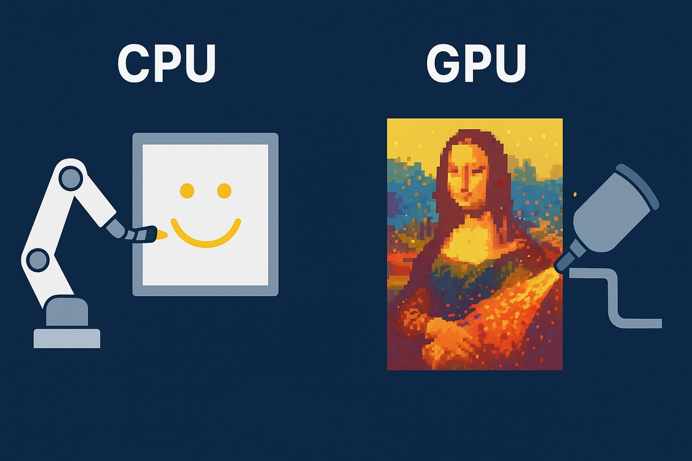
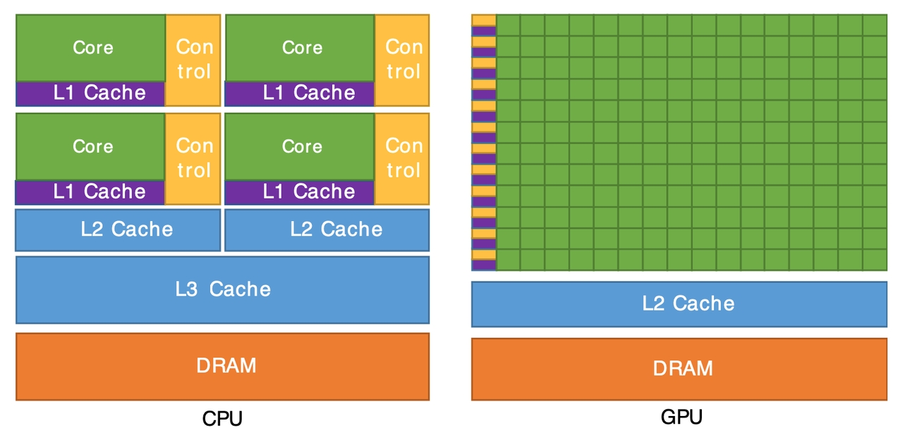
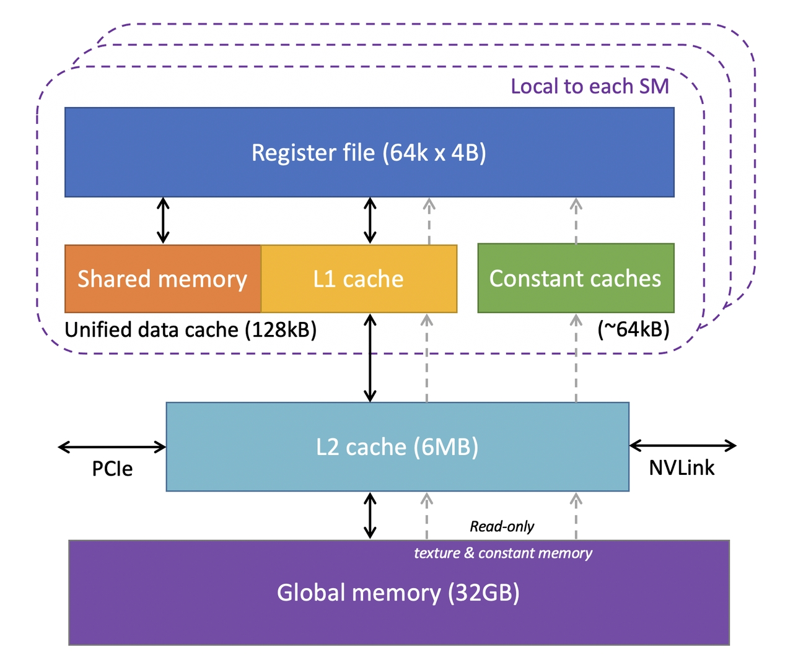
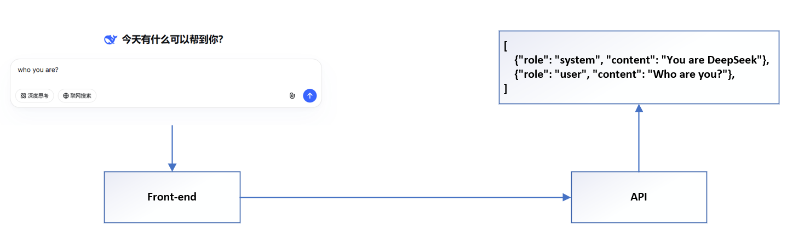
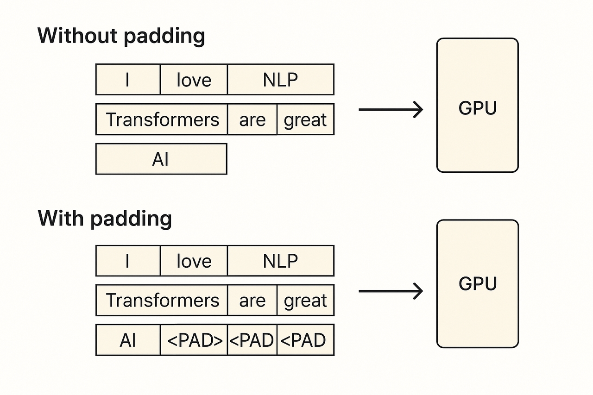
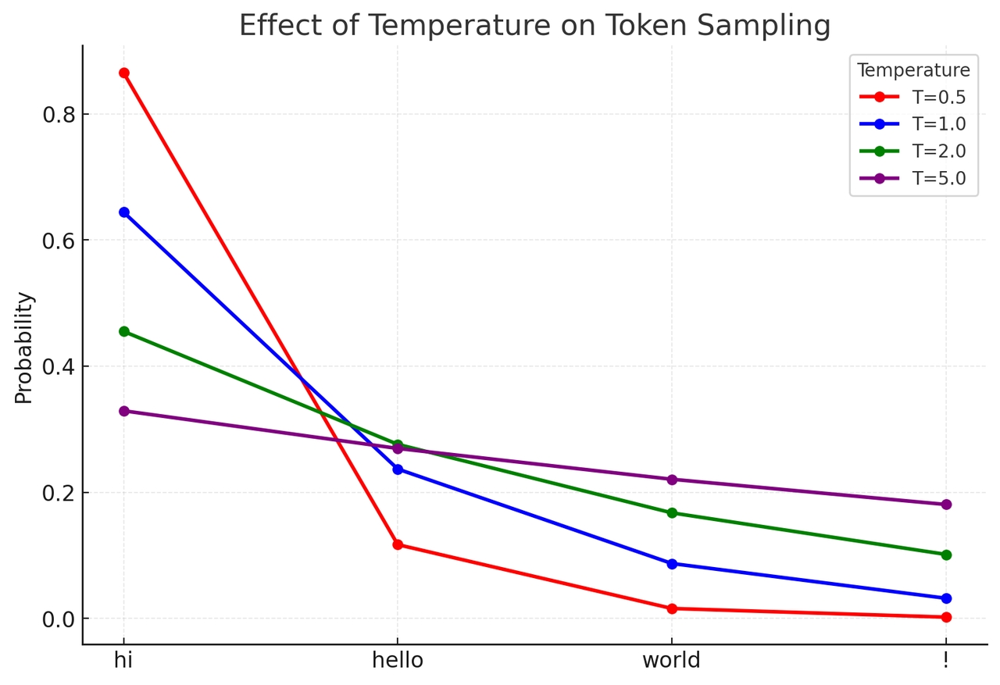
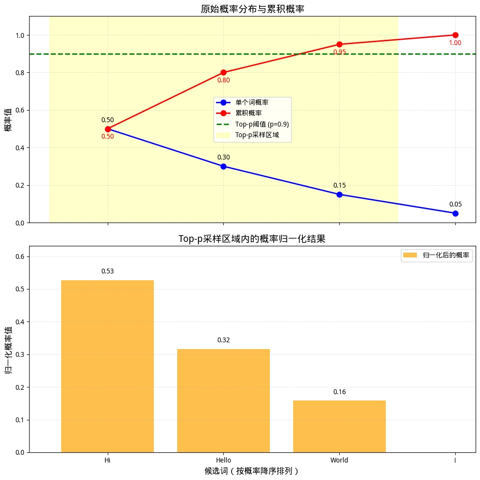
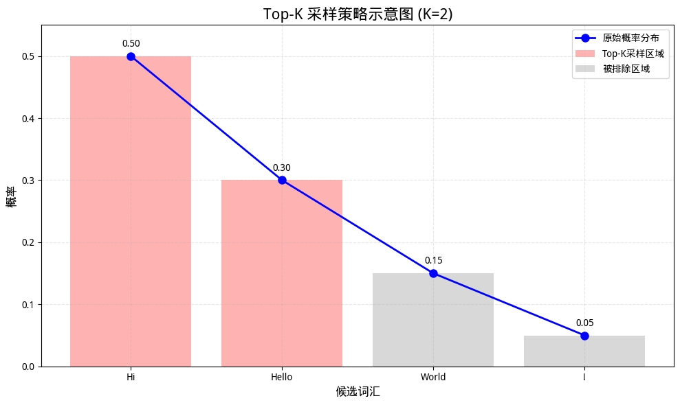

> AI时代无论从算法、工程、落地、还是应用的角度，都有必要对其有基本的了解
>
> 本文非常适合小白入门
    
# GPU   

>  Generate by AI，值观说清楚gpu和cpu的最大区别 

   

> gpu和cpu的简要结构图，由此可见二者特性差异 

   

通常来说   
- 主频:CPU>GPU   
- 计算单元:CPU<GPU   
   
> GPU的基础架构图
   
 
 此外，现代 GPU 还集成了多种 专用计算单元， 比如张量核心（Tensor Cores）、光线追踪单元（Ray Tracing Units） 以便在深度学习、图形渲染等特定场景下实现更高效的加速。

---

 这里简单列了几个常见典型GPU的性能，给大家直观感受GPU的特点     
| 指标 | Tesla V100 | A100 | H100 | H200 |
|------|------------|------|------|------|
| 架构 | Volta | Ampere | Hopper | Hopper 改进版 |
| 发布年份 | 2017 | 2020 | 2022 | 2024 |
| FP32性能 (TFLOPS) | 15.7 | 19.5 | 60 | 67 |
| 显存容量 | 16 GB / 32 GB | 40 GB / 80 GB | 80 GB | 141 GB |
| 显存类型 | HBM2 | HBM2e | HBM3 | HBM3e |
| 显存带宽 | 900 GB/s | 1.9 – 2.0 TB/s | 3.35 TB/s | 4.8 TB/s |
| 功耗 (TDP) | 300 W | 300 – 400 W | 700 W | 600 – 700 W |   

# LLM   
   
## 从文本到机器指令   

### Prompt Engineer    

>  所见非所得    

   
 服务层会内置部分Prompt **Adapter/Wrapper**    

>  部署时针对模型做的标签适配，很多时候api提供商(尤其针对开源)不一定能将其全部转义，因此设计Prompt时候应该尽量避免使用    
   

``` json
messages = [
    {"role": "system", "content": "You are DeepSeek"},
    {"role": "user", "content": "Who are you?"},
    {"role": "assistant", "content": "<think>Hmm</think>I am DeepSeek"},
    {"role": "user", "content": "hello world!"}
]
```

``` python
# 历史不带思维连
<｜begin▁of▁sentence｜>
You are Deepseek
<｜User｜>Who are you?
<｜Assistant｜></think>I am DeepSeek
<｜end▁of▁sentence｜>

# 思考模式
<｜User｜>hello world!
<｜Assistant｜><think>

# 非思考模式
<｜User｜>hello world!
<｜Assistant｜></think>
```

### Tokenization    

>  Byte Pair Encoding (目前LLM最常用)  Y. Shibata, T. Kida, S. Fukamachi, M. Takeda, A. Shinohara, T. Shinohara, and S. Arikawa. Byte pair encoding: A text compression scheme that accelerates pattern matching. 1999.    
   

``` shell
# tiktoken:a fast open-source tokenizer by OpenAI

Example string: "antidisestablishmentarianism"
r50k_base: 5 tokens
token integers: [415, 29207, 44390, 3699, 1042]
token bytes: [b'ant', b'idis', b'establishment', b'arian', b'ism']

Example string: "2 + 2 = 4"
r50k_base: 5 tokens
token integers: [17, 1343, 362, 796, 604]
token bytes: [b'2', b' +', b' 2', b' =', b' 4']


Example string: "你好"
r50k_base: 4 tokens
token integers: [19526, 254, 25001, 121]
token bytes: [b'\xe4\xbd', b'\xa0', b'\xe5\xa5', b'\xbd']
```

``` shell
# google sentencepiece

原句: hello worldwide
BPE分词: ['▁', 'he', 'll', 'o', '▁', 'w', 'o', 'r', 'l', 'd', 'w', 'i', 'd', 'e']
Unigram分词: ['▁hello', '▁world', 'w', 'i', 'd', 'e']

原句: 天气预报说今天天气不错
BPE分词: ['▁天气预', '报说', '今', '天', '天气', '不错']
Unigram分词: ['▁', '天气', '预', '报', '说', '今', '天', '天气', '不', '错']
```

``` python
# Qwen tokenizer 
from transformers import AutoTokenizer

tokenizer = AutoTokenizer.from_pretrained('Qwen/Qwen-7B', trust_remote_code=True)

>>> tokenizer.tokenize("Panda")
[b'P', b'anda']

>>> tokenizer.tokenize(" Panda")
[b' Panda']

>>> tokenizer.tokenize("Pandas")
[b'P', b'andas']

>>> tokenizer.tokenize(" Pandas")
[b' Pand', b'as']
```

### Embedding

>  注意：LLM识别的token是有限的，例如 deepseekv3词汇表是129280,Qwen3是151669    
   
从token->向量 注意区分embedding模型和embedding层   
- Embedding 模型 （学好普通话）   
    - Word2Vec、GloVe、FastText: 专注于训练各token的通用表征/含义   
- LLM Embedding层 （只要能理解，方言也够用，本质只是一个线性层）   
    - 将模型和Embedding耦合，为LLM提供适配的表征   
   

>  虽然传统NLP的embedding是外置的，但对于多数llm来说embedding会内置再模型内部 (*一个线性层*)   
   

``` python 
# deepseek v3 .1部分配置
{
    "vocab_size": 129280,
    "dim": 7168,
    "inter_dim": 18432,
    "moe_inter_dim": 2048,
    "n_layers": 61,
    "n_dense_layers": 3,
    "n_heads": 128,
    "n_routed_experts": 256,
    "n_shared_experts": 1,
    "n_activated_experts": 8,
    "n_expert_groups": 8,
    "n_limited_groups": 4,
    "route_scale": 2.5,
    "score_func": "sigmoid",
    "q_lora_rank": 1536,
    "kv_lora_rank": 512,
    "qk_nope_head_dim": 128,
    "qk_rope_head_dim": 64,
    "v_head_dim": 128,
    "dtype": "fp8",
    "scale_fmt": "ue8m0"
}
```

### Padding    

GPU天然适合并行计算,因此输入通常批量输入到GPU中，而由于请求长度不一，因此需要做padding对齐    
   
> generate by AI,很清晰

   
    
## LLM输出不稳定性   

### LLM后采样/解码策略/参数导致的不稳定    

**Temperture**
> 调整输出token概率分布的平滑度

$$ 
P(w_i) = \frac{\exp{(Tem\cdot \log{P(w_i)})}}{\sum_j{\exp(Tem\cdot\log(P(w_j))}}   
$$

> generate by AI, 
>
> 值越大 ,输出多样性越强 (文本生成,创意写作)
>
> 值越小,越趋近于最大概率的token,既稳定性越强 (数据标注,数学等)   
   

   
**Top-P**   
设候选词
$$
\begin{aligned}
P(w_1) \geq P(w_2) \geq ... \geq P(w_n)\\ S = \{w_1,w_2,\ldots,w_k∣k=min\{m\in N∣ \sum^m_{i=1}P(w_i)\geq \mathit{Top_p}\}\}\\ \hat{P}_{w_i} = \frac{P(w_i)}{\sum^k_{j=1}P(w_j)}
\end{aligned}
$$   

   

**Top-k**
> 限制候选token数量,控制输出多样性   

   

**Max-Token**

模型输出token达固定长度直接结束 

**Stop-Sequence**

模型输出token命中固定序列直接结束 

**Frequency/Presence Penalty**
> 惩罚相同token输出概率,控制输出多样性   

$$
\begin{aligned}
\hat{P}_{Frequency}(w)∝P(w)⋅exp(−λ⋅Frequency(w)) \\
\hat{P}_{Presence}(w)∝P(w)⋅exp(−λ⋅(Frequency(w)>0))
\end{aligned}
$$