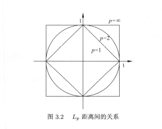
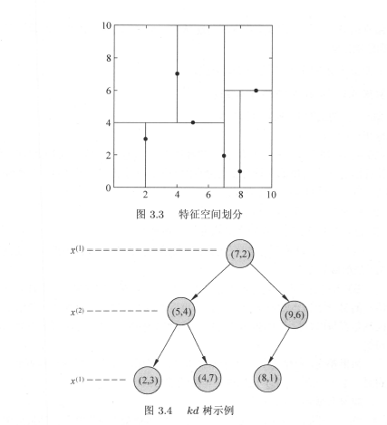
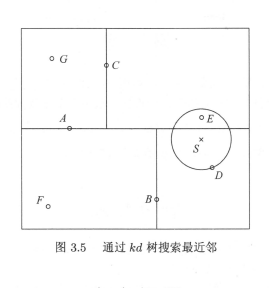

> k近邻算法：
>
> 给定的一个训练数据集，对新的输入实例，在训练数据集中找到与该实例最的k个实例，这k个实例的多数属于某个类，就将该实例划分进入这个类中；(哲学上讲的话，有点近朱者赤近墨者黑的味道~~)

## 算法核心原理

* 根据给定的**距离度量**，在训练数据集*T*中找出与*x*最近邻的*k*个点，涵盖这*k*个点的邻域记为

  $N_{k}(x)$;
* 在$N_{k}(x)$中根据**分类决策规则**决定$x$的类别$Y$;

  $$
  Y= arg\max \sum_{x_i\in N_{k}(x)}I(y_{i}=c_{j}),i=1,2 \ldots,N;j=1,2 \ldots,K;\text{其中}I\text{为指示函数};\text{即}y_i=c_j\text{时}I\text{为}1,\text{否则为}I\text{为}0;
  $$

  ***k近邻没有显示的学习过程***

## k近邻模型

k近邻算法使用的模型实际上 对应于特征空间的划分；模型有三个基本要

* 度量距离
* k值的选择
* 分类决策的规则

### 距离度量

将设特征空间$X$是$n$维实数向量空间$R^n$,$x_i,x_j\in X,x_i=(x_i^{(1)},x_i^{(2)},\cdots,x_i^{(n)})^T,x_j=(x_j^{(1)},x_j^{(2)},\cdots,x_j^{(n)})^T,x_i,x_j\text{的}L_p\text{距离定义为}$

$$
L_p(x_I,x_j)=(\sum^n_{l=1}|x_i^{(l)}-x_j^{(l)}|)^{\frac1p}
$$

其中$P\geq 1$

* $p=1$称为曼哈顿距离
* $p=2$称为欧氏距离
* $p=\infty$时，他是各个坐标距离的最大值

如图

### k值的选择

- k值小，预测结果对近邻实例点非常敏感，而且k值减小模型就会变得复杂而且容易发生过拟合；
- k值大，学习的近似误差会增大，也就意味这模型会变得简单；

  **通常采用交叉验证发来选取最优k值**

### 分类决策规则

k近邻法的分类决策规则往往是多数表决；

如果分类损失函数为0-1损失函数，分类函数为

$$
f:R^n \to \{c_1,c_2,\cdots,c_k\}
$$

那么误分类的概率

$$
P(Y\neq f(X)) = 1-P(Y=f(X))
$$

对于给定的实例$x\in X$,其最近邻的$k$个训练实例点构成的集合$N_k(x)$,如果覆盖$N_k(x)$的区域类别为$c_j$,那么误分类

$$
\frac1k\sum_{x_i\in N_k(x)} = 1-\frac1k\sum_{x_i\in N_k(x)}I(y_i=c_j)
$$

使得误分类概率最小就是经验风险最小，也就是$\frac1k\sum_{x_i\in N_k(x)}I(y_i=c_j)$最大；也就是说多数表决规则等价于经验风险最小化；

## K近邻算法实现：kd树

由于实现k近邻算法要对已划分数据进行搜算，数据量大时会耗费大量时间，因此有很多优化提高效率的算法；dk树就是其中的一种

### 构造kd树

1. 构造根节点，根节点对应于包含$T$的k维空间的超矩形区域；
2. 选择$x^{(1)}$为坐标轴，以$T$中所有实例的$x^{(1)}$坐标的中位数为切分点，将根节点对应的超矩形区域切分为两个子区域；切分由通过切分点并与坐标轴$x^{(1)}$垂直的超平面实现；左子节点存放对应坐标小于切分点的点、右边存放大于切分点的，根节点保存出与切分平面上的点；
3. 重复：对于深度为j的节点，选择$x^{(l)}$为切分的坐标轴，$l=j(mod\,k)+1$,以该节点的区域中所有实例的$x^{(l)}$坐标的中位数为切分点，再次进行与（2）中类似的划分；
4. 直到两个子区域没有实例存在时停止，从而形成$kd$树的区域划分；

图示如下

### 搜索kd树

包含目标点的叶节点对应的包含目标点的最小超矩形区域。以此叶节点的实例点作为当前最近点。目标点的最邻近点一定在以目标点为中心并通过当前最近点的超群体内部。然后返回当前节点的父节点，如果父节点的另一子节点的超矩形区域与超球体相交，那么在相交区域内寻找与目标结点最近的点。如果存在，将此作为新的最近点。算法转到更上一级父节点继续上述过程；如果父节点另一子节点的超矩形区域与超球体不相交，或不存在比当前最近点更近点则停止操作；

1. 在kd树中找出包含目标点x的叶节点：从根节点出发递归的向下方位，直到子节点为叶节点为止；
2. 以此叶节点为“当前最近点”；
3. 递归的向上回退，在每个节点执行下述操作
   * 如果该节点保存的实例点比当前最近点距离目标更近，则该实例点为“当前最近点”；
   * 当前最近点一定位于该节点一个子节点对应的区域，检查该子节点的父节点的另一个子节点对应的区域是否有更近的点，有则确认零一点为最近点----具体可检查另一子节点对应区域是否以目标点为球心、以当前最小距离为半径的超球体相交；
   * 不相交则向上回退；
4. 回退到根节点，搜索结束；

图示如下

**$kd$树搜索平均计算复杂度是$O(log\,N)$,$N$为训练实例数。kd树适合用于训练实例数远大于空间维数时的k紧邻搜索。二者接近时，$kd$树效率会迅速下降，几乎线性扫描；**
