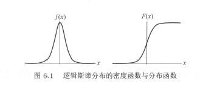
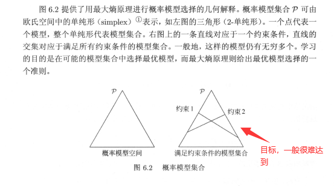
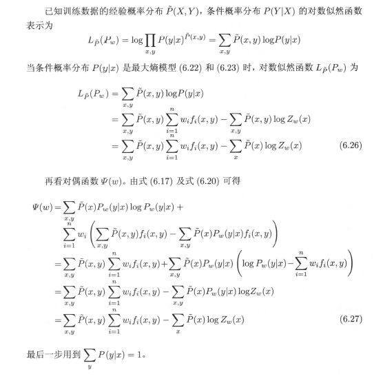

> 介绍 logistic 回归模型，利用最大熵原理来解释 logistic 回归，再从中进一步抽象出更加通用的"最大熵模型"，对最大熵模型进行推导，证明其合理性，并给出具体的使用方法，还会用最大熵模型来推导出 logistic 回归，以此作为最大熵模型示例

# logistic回归模型

## logistic分布

**定义logistic分布**

$$
\begin{aligned}
F(x)=P(X\leq x)=\frac1{1+e^{-(x-\mu)/\gamma}}\\f(x)=F^{'}(x)=\frac{e^{-(x-\mu)/\gamma}}{\gamma(1+e^{-(x-\mu)/\mu})^2}
\end{aligned}
$$

分布函数图像是一条S形曲线，以点$(\mu,\frac12)$为中心对称，如下图

## 二项logistic回归模型

**定义二项logistic是如下条件概率分布**

$$
\begin{aligned}
p(Y=1|x)=\frac{\exp(w\cdot x+b)}{1+\exp(w\cdot x+b)}
p(Y=0|x)=\frac1{1+\exp(w\cdot x+b)}
\end{aligned}
$$

为了方便有时将偏置并入权重中，即$w=(w^{(1)},w^{(2)},\cdots,w^{(n)},b)^T,x=(x^{(1)},x^{(2)},\cdots,x^{(n)},1)$,同时***logistic***模型简写为

$$
\begin{aligned}
p(Y=1|x)=\frac{\exp(w\cdot x)}{1+\exp(w\cdot x)}
p(Y=0|x)=\frac1{1+\exp(w\cdot x)}
\end{aligned}
$$

定义对数几率（log odds)或***logit***函数为

$$
logit(p)=log\frac p{1-p}
$$

对logistc回归而言

$$
log\frac{P(Y=1|x)}{1-P(Y=1|x)}=w\cdot x
$$

说明了在*logistic*回归中，输出$Y=1$的对数概率是输入$x$的线性函数；通过*logistic*回归定义模型可以将线性函数$w\cdot x$转换为概率；

## 模型的参数估计

对于给定训练数据集可以应用极大似然估计法估计模型参数，

设

$$
P(Y=1|x)=\pi(x),\,\,\,P(Y=1|x)=1-\pi(x)
$$

似然函数为

$$
\prod^N_{i=1}[\pi(x_i)]^{y_i}[1-\pi(x_i)]^{1-y_i}
$$

对数似然函数

$$
\begin{aligned}
L(w)=\sum\limits ^N_{i=1}[y_i\log\pi(x_i)+(1-y_i)\log(1-\pi(x_i))]     \\
=\sum\limits^N_{i=1}[y_i(w\cdot x_i)-\log(1+\exp(w\cdot x_i)]    \\
\end{aligned}
$$

对$L(w)$求极大值，得到$w$的估计值；至此通常采用梯度下降法或者拟牛顿法来求解；

## 多项logistic回归

将其从二项推广到多项*logistic*回归模型

$$
\begin{aligned}
P(Y=k|x)=\frac{\exp(w_k\cdot x)}{1+\sum\limits^{k-1}_{k=1}\exp(w_k\cdot x)},k=1,2,\cdots,K-1\\P(Y=K|x)=\frac1{1+\sum\limits^{k-1}_{k=1}\exp(w_k\cdot x)}
\end{aligned}
$$

同理，二项*logistic*回归的参数估计法也可以推广到多项*logistic*回归；

# 最大熵模型

## 原理

最大熵模型是概率模型学习的一个准则，最大熵原理认为，在所有可能的概率模型中，熵最大的是最好的模型，通常用约束条件确定概率模型的集合；设离散变量$X$分布是$P(X)$，熵为

$$
H(P)=-\sum\limits_xP(x)\log P(x)
$$

且满足不等式

$$
0\leq H(P) \leq \log|X|
$$

直观的，在没有更多信息的情况下认为不确定部分是等可能的，“等可能”不易操作，而熵则是一个可优化的指标以此来达到等可能的目的；

## 最大熵模型定义

对于给定训练数据集

$$
\begin{aligned}
\hat P(X=x,Y=y)=\frac{v(X=x,Y=y)}N     \\
\hat P(X=x)=\frac{v(X=x)}N     \\
\text{其中}v(X=x,Y=y)\text{表示样本}(x,y)\text{出现的频数};    \\

\end{aligned}
$$

特征函数$f(x,y)$定义

$$
\begin{aligned}
f(x)=\left\{ \begin{aligned}
1,&\,\,x\text{与}y\text{满足某一事实}
0,&\,\text{否则}
\end{aligned}\right.    \\
\end{aligned}
$$

特征函数$f(x,y)$关于经验分布$\hat P(X,Y)$的期望值表示为

$$
E_\hat p(f)=\sum_{x,y}\hat P(x,y)f(x,y)
$$

特征函数$f(x,y)$关于模型$P(Y|X)$与经验分布$\hat P(X)$的期望值

$$
E_ p(f)=\sum_{x,y}\hat P(x)P(y|x)f(x,y)
$$

如果模型能够获取训练数据中的信息，那么可以假设这两个期望值相等

$$
E_p(f)=E_\hat p(f)
$$

**假设满足所有约束条件的模型集合为**

$$
C\equiv\{P\in p|E_P(f_i)=E_\hat p(f_i),i=1,2,\cdots,n\}
$$

定义在条件概率分布$P(Y|X)$上的条件熵为

$$
H(P)=-\sum\limits_{x,y}\hat p(x)P(y|x)\log P(y|x)
$$

则模型集合$C$中条件熵$H(P)$最大的模型为最大熵模型，其中的对数为自然对数；

## 最大熵模型的学习

最大熵模型的学习可以形式化为约束最优化问题；

对于给定的训练数据集$T$以及特征函数$f_i(x,y),i=1,2,\cdots,n$,最大熵模型的学习等价于约束最优化问题

$$
\begin{aligned}
\max\limits_{p\in C}\,H(P)=-\sum\limits_{x,y}\hat P(x)P(y|x)\log P(y|x)     \\
& s.t.\,\,\,\,\,E_p(f_i)=E_{\hat p}(f_i),\,i=1,2,\cdots,n     \\
\sum_yP(y|x)=1    \\

\end{aligned}
$$

按照习惯可以将其等价的改为最小值问题

$$
\begin{aligned}
\max\limits_{p\in C}\,H(P)=-\sum\limits_{x,y}\hat P(x)P(y|x)\log P(y|x)     \\
& s.t.\,\,\,\,\,E_p(f_i)=E_{\hat p}(f_i),\,i=1,2,\cdots,n     \\
\sum_yP(y|x)=1    \\

\end{aligned}
$$

求约束最优化问题就是求解最大熵模型。可以将约束最优化问题转化为无约束最优化的对偶问题。通过求解对偶问题来求解原始问题；

---

**具体推导**

引入拉格朗日乘子$w_0,w_1,\cdots,w_n$,定义拉格朗日函数$L(P,w)$;

$$
\begin{aligned}
L(P,w)\equiv-H(P)+w_0(1-\sum\limits_yP(y|x))+\sum\limits^n_{i=1}w_i(E_\hat p(f_i)-E_p(f_i))     \\
=\sum\limits_{x,y}\hat P(x)P(y|x)\log P(y|x)+w_0(1-\sum_yP(y|x))+\sum^n_{i=1}w_i(\sum\limits_{x,y}\hat P(x,y)f_i(x,y)-\sum_{x,y}\hat P(x)P(y|x)f_i(x,y))    \\

\end{aligned}
$$

最优化原始问题

$$
\min_{p\in C} \max_wL(P,w)
$$

对偶问题

$$
\max_w\min_{P\in C}L(P,w)
$$

由于拉格朗日函数$L(P,w)$是$P$的凸函数，原始问题与对偶问题是等价的（对偶问题的定理)首先记作

$$
\psi(w)=\min_{p\in C}L(P,w)=L(P_w,w)
$$

$\psi(w)$称为对偶函数，同时，其解记作

$$
P_w=\arg\min_{p\in C}L(P,w)=P_w(y|x)
$$

具体的求$L(P,w)$对$P(y|x)$的偏导数，令偏导数等于0，解得

$$
P(y|x)=\exp(\sum_{i=1}^nw_if_i(x,y)+w_0-1)=\frac{\exp(\sum\limits_{i=1}^nw_if_i(x,y))}{\exp(1-w_0)}
$$

由于$\sum\limits_yP(y|x)=1$,得

$$
\begin{aligned}
P_w(y|x)=\frac1{Z_w(x)}\exp(\sum\limits^n_{i=1}w_if_i(x,y))     \\
\text{其中},\,\,\,Z_w(x)=\sum\limits_y\exp(\sum^n_{i=1}w_if_i(x,y))    \\

\end{aligned}
$$

之后求解外部的极大化问题

$$
\max\limits_w\psi(x)
$$

记其解为$w^*$,

$$
w^*=\arg\max\limits_w\psi(w)
$$

## 极大似然估计

对偶函数的极大化等价于最大熵模的极大似然估计；

证明过程：

这样最大熵模型的学习问题就可以转换为具体的求解对数似然函数极大化或对偶函数极大化的问题；写成更一般的形式

$$
\begin{aligned}
P_w(y|x)=\frac1{Z_w(x)}\exp(\sum_{i=1}^nw_if_i(x,y))\\\text{其中},
\,\,\,Z_w(x)=\sum\limits_y\exp(\sum^n_{i=1}w_if_i(x,y))
\end{aligned}
$$

## 深入理解

最大熵模型与*logistic*回归模型有着类似的形式，它们又称为对数线性模型（log linear model）,模型学习就是在给定的训练数据集条件下对模型进行极大似然估计或正则化的极大似然估计；

---

事实上，定义特征函数，其中$g(x)$为提取出每个x的特征，，输出是$x$的特征向量：

$$
\begin{aligned}
\left\{\begin{aligned}
&g(x),y=1     \\
&0,\quad y=0     \\
\end{aligned}\right.    \\

\end{aligned}
$$

将以上特征带入到最大熵模型中

$$
P(y=1|x)=\frac{\exp(w_ig(x))}{\exp(w_ig(x))+\exp(w_i*0)}
$$

上下同时除$\exp(w_ig(x))$,得

$$
P(y=1|x)=\frac1{1+\exp(-w_ig(x))}
$$

同理

$$
\begin{aligned}
P(y=0|x)=\frac{\exp(w_i\cdot0)}{\exp(w_ig(x))+\exp(w_i*0)}
=\frac1{\exp(w_ig(x))+1}

\end{aligned}
$$

自然的发现*logistic*回归模型其实就是最大熵模型在$y=1$时抽取x的特征这一情况；之前我们用极大似然估计求参数$w_i$其实这样求出的模型就是$\max P_w(y|x)$,所以就是求最大熵模型；

日常生活中，我们经常不知不觉的就是用了最大熵模型，这里给出了更高层面的抽象的最大熵模型；显然最后的例子也说明了$logistic$回归其实也是一种最大熵模型；

# 模型的最优化算法

逻辑斯蒂回归模型、最大熵模型归结为似然函数为莫表的最优化问题，通常通过迭代算法求解，从最优化的角度上来看这时的目标函数具有很好的性质，他是光滑的凸函数；因此多种最优化方法都适用；常用的方法有改进的迭代尺度法、梯度下降法、牛顿法、拟牛顿法。牛顿法或拟牛顿法；牛顿法或者拟牛顿法一般收敛速度更快；

**最大熵模型**

$$
\begin{aligned}
P_w(y|x)=\frac1{Z_w(x)}\exp(\sum_{i=1}^nw_if_i(x,y))\\\text{其中},
\,\,\,Z_w(x)=\sum\limits_y\exp(\sum^n_{i=1}w_if_i(x,y))
\end{aligned}
$$

对数似然函数

$$
L(w)=\sum\limits_{x,y}\hat P(x,y)\sum^n_{i=1}w_if_i(x,y)-\sum_x\hat P(x)\log Z_w(x)
$$

## 改进的迭代尺度算法(IIS)

### 原理

**IIS**核心想法是：建设最大熵模型当前的参数向量是$w=(w_1,w_2,\cdots,w_n)^T$,我们希望找到一个新的参数向量$w+\delta=(w_1+\delta_1,w_2+\delta_2,\cdots,w_n+\delta_n)$,使得模型的对数似然函数值增大。如果能有一种参数更新方法让$w\rightarrow+\delta$,那么重复使用即可找到对数似然函数的最大值；

对于给定的经验分布$\hat P(x,y)$,对数似然函数的该变量是

$$
L(w+\delta)-L(w)=\sum\limits_{x,y}\hat P(x,y)\sum^n_{i=1}\delta_if_i(x,y)-\sum_x\hat P(x)\log\frac{Z_{w+\delta}(x)}{Z_w(x)}
$$

利用不等式

$$
-\log\alpha\geq1-\alpha,\alpha>0
$$

则

$$
\begin{aligned}
-\sum\limits_x\hat P(x)\log\frac{Z_{w+\delta}(x)}{Z_w(x)}
\geq\sum_x\hat P(x)(1-\frac{Z_{w+\delta}(x)}{Z_w(x)})     \\
\geq\sum_x\hat P(x)-\sum_x\hat P(x)\frac{Z_{w+\delta}(x)}{Z_w(x)}
\geq1-\sum_x\hat P(x)\frac{Z_{w+\delta}(x)}{Z_w(x)}

\end{aligned}
$$

$$
L(w+\delta)-L(w)=\sum\limits_{x,y}\hat P(x,y)\sum^n_{i=1}\delta_if_i(x,y)+1-\sum_x\hat P(x)\sum_yP_w(y|x)\exp(\sum^n_{i=1}\delta_if_i(x,y))
$$

右端记为$A(\delta|w)$，于是

$$
L(w+\delta)-L(w)\geq A(\delta|w)
$$

如果能找到合适的$\delta$使得下界$A(\delta|w)$提高，那么对数似然函数也会提高；然而，函数其中的遍量$\delta$是一个向量含有多个变量，不易同时优化。IIS试图一次只优化其中一个变量$\delta_i$,而固定其他变量；

为此引入一个新的量

$$
f^\#(x,y)=\sum\limits_if_i(x,y)
$$

于是

$$
A(\delta|w)=\sum\limits_{x,y}\hat P(x,y)\sum^n_{i=1}\delta_if_i(x,y)+1-\sum_x\hat P(x)\sum_yP_w(y|x)\exp(f^\#(x,y)\sum^n_{i=1}\frac{\delta_if_i(x,y))}{f^\#(x,y)}
$$

由于$\frac{f_i(x,y)}{f^\#(x,y)}\geq0$且$\sum\limits^n_{i=1}\frac{f_i(x,y)}{f^\#(x,y)}=1$,根据$Jensen$不等式，得到

$$
\exp(\sum^n_{i=1}\frac{f_i(x,y))}{f^\#(x,y)}\delta_if^\#(x,y))\leq \sum^n_{i=1}\frac{f_i(x,y))}{f^\#(x,y)}\exp(\delta_if^\#(x,y))
$$

记$A(\delta|x)$改写后的为$B(\delta|x)$

$$
B(\delta|x)=\sum\limits_{x,y}\hat P(x,y)\sum^n_{i=1}\delta_if_i(x,y)+1-\sum_x\hat P(x)\sum_yP_w(y|x)\sum^n_{i=1}\frac{f_i(x,y))}{f^\#(x,y)}\exp(\delta_if^\#(x,y))
$$

于是

$$
L(w+\delta)-L(w)\geq B(\delta|w)
$$

显然其是对数似然函数的一个新的下界，求$B(\delta|w)$对$\delta_i$的偏导数，并令其为0得到

$$
\sum_{x,y}\hat P(x)P_w(y|x)f_i(x,y)\exp(\delta_i,f^\#(x,y))=E_\hat P(f_i)
$$

依次对其求解可算出$\delta$;

### 算法

*input:*特征函数$f_1,f_2,\cdots,f_n$,经验分布$\hat P(X,Y)$,模型$P_w(y|x)$

*output:*最优参数值$w_i^*$;最优模型$P_w$

1. 对所有的$i\in \{1,2,\cdots,n\}$,取初值$w_i=0$
2. 对每一$i\in \{1,2,\cdots,n\}$

   1. 令$\delta_i$是方程

   $$
   \begin{aligned}
   \begin{aligned}
   \sum_{x,y}\hat P(x)P_w(y|x)f_i(x,y)\exp(\delta_i,f^\#(x,y))=E_\hat P(f_i)  \\
   \text{其中},f^\#(x,y)=\sum\limits_if_i(x,y) \\
   \end{aligned}
   \end{aligned}
   $$

   的解；

   2. 更新$w_i$值：$w_i\leftarrow w_i+\delta_i$
3. 若不是所有的$w_i$都收敛，重复2

---

这一算法的关键一步就是2.1,求解其中的$\delta_i$,如果$f^\#(x,y)$是常数，则可以显示的表示为

$$
\delta_i=\frac1M\log \frac{E_\hat p(f_i)}{E_p(f_i)}
$$

若$f^\#(x,y)$不是常数，那么必须通过数值计算$\delta_i$，简单有效的方法就是拟牛顿法；

以$g(\delta_i)=0$表示2.1中的方程，牛顿法通过迭代求得的$\delta^*_i$,使得$g(\delta_i^*)=0$,迭代公式

$$
\delta_i^{(k+1)}=\delta_i^{(k)}-\frac{g(\delta_i^{(k)})}{g^{'}(\delta_i^{(k)})}
$$

只要适当的选取初始值$\delta_i^{(0)}$,由于$\delta_i$的方程有单根，因此牛顿法恒收敛，而且收敛速度很快；

### 拟牛顿法

对于最大熵模型而言

---

$$
\begin{aligned}
P_w(y|x)=\frac{\exp(\sum\limits_{i=1}^nw_if_i(x,y))}{\sum\limits_y\exp(\sum\limits_{i=1}^nw_if_i(x,y))}
\end{aligned}
$$

目标函数(极大化似然函数就等价于)

$$
\min\limits_{w\in R^n}\quad f(w)=\sum_x\hat P(x)\log\sum_y\exp(\sum^n_{i=1}w_if_i(x,y))-\sum_{x,y}\hat P(x,y)\sum^n_{i=1}w_if_i(x,y)
$$

梯度

$$
g(w)=(\frac{\partial f(w)}{\partial w_1},\frac{\partial f(w)}{\partial w_2},\cdots,\frac{\partial f(w)}{\partial w_n})^T
$$

其中

$$
\frac{\partial f(w)}{\partial w_i}=\sum\limits_{x,y}\hat P(x)P_w(y|x)f_i(x,y)-E_{\hat P}(f_i),\quad i=1,2,\cdots,n
$$

---

最大熵模型学习的BFGS算法

*input*:特征函数$f_1,f_2,\cdots,f_n$;经验分布$\hat P(x,y)$,目标函数$f(w)$,梯度$g(w)=\Delta f(w)$,精度要求$\epsilon$

*output*:最优参数值$w^*$；最优模型$P_w\cdot(y|x)$

1. 选定初始点$w^{(0)}$，取$B_0$为正定对称矩阵，置$k=0$;
2. 计算$g_k=g(w^{(k)})$,若$||g_k||<\epsilon$,则停止计算，得$w^*=w^{(k)}$,否则跳转3；
3. 由$B_kp_k=-g_k$求出$p_k$;
4. 一维搜索：求$\lambda_k$使得

$$
f(w^{k}+\lambda_kp_k)=\min_{\lambda\geq0}f(w^{(k)}+\lambda p_k)
$$

5. 置$w^{(k+1)}=w^{(k)}+\lambda_kp_k$;
6. 计算$g_{k+1} = g(w^{(k+1)})$,若$||g_k||<\epsilon$,则停止计算，得$w^*=w^{(k)}$,否则求出$B_{k+1}$

$$
\begin{aligned}
B_{k+1}=B_k+\frac{y_ky_k^T}{y^T_k\delta_k}-\frac{B_k\delta_k\delta_k^TB_k}{\delta^T_kB_k\delta_k}
\text{其中},y_k=g_{k+1}-g_k,\delta_k=w^{(k+1)}-w^{(k)}

\end{aligned}
$$

7. 置$k=k+1$,转至3；
