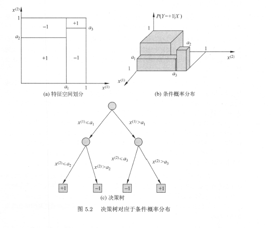
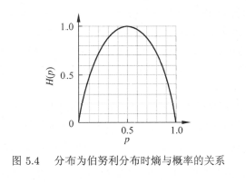
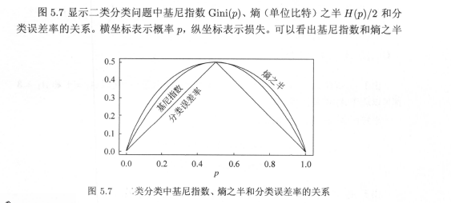

# 核心原理

> 可以将决策树看成是一个if-then规则的集合，决策树的路径或其对应的if-then规则集合**互斥且完备**；每一个实例都被一条路径或一条规则覆盖，而且只被一条路径或规则覆盖；

决策树与条件概率分布示意图

**决策树学习的目标**

根据给定的训练数据集构建一个决策树模型（学习），并使他们能够对实例进行正确的分类(泛		化)；

**决策树学习的损失函数通常是正则化的极大似然函数。决策树学习的策略是以损失函数为目标函数的最小化**；损失函数确定后，学习问题就变成了损失函数意义下选择最优决策树的问题；由于从所有决策树中寻找最优决策树是np完全问题，所以常常使用启发式的算法来近似求解这一最优化问题；以此寻找到次最优的；

---

**决策树学习的核心**

- 特征选择——（选取核心数据）
- 决策树生成——（构建决策树）——局部最优
- 决策树剪枝——（提高泛化能力）——全局最优

# 特征选择

## 信息增益

**信息增益是衡量特征选择的一个重要指标；**用表示训练数据集对应某个特征所具备的分类能力；

### 熵

> 信息论与概率统计中，熵（entropy）是表示随机变量不确定性的度量。设X是一个取有限个值的离散随机变量，其概率分布为
>
> $$
> P(X=x_i)=p_i,i=1,2,\cdots,n
> $$
>
> 则随机变量的熵定义为
>
> $$
> \begin{aligned}
> H(X)=-\sum\limits^n_{i=1}p_i\log p_i\\\text{其中定义}:0\log0=0
> \end{aligned}
> $$
>
> 其中对数常取2为底或者e为底，这时熵的单位分别是比特或纳特。从定义可知熵只依赖于X的分布，而与X的取值无关，所以也将X的熵就做$H(p)$;熵越大，随机变量的不确定性就越大，且有定义可知
>
> $$
> 0\leq H(p)\leq\log n(\text{基本不等式可推导})
> $$
>
> p_当随机变量只有两个取值0，1时，熵为
>
> $$
> H(p)=-p\log_2p-(1-p)\log_2(1-p)
> $$
>
> 这时熵$H(p)$随概率$p$变化的曲线如图所示
>
> 
>
> 条件熵$H(Y|X)$表示在随机变量X已知的条件下随机变量Y的不确定性。定义为X给定条件下Y的条件概率分布的熵对X的数学期望
>
> $$
> H(Y|X)=\sum\limits_{i=1}^np_iH(Y|X=x_i),\text{其中}p_i=P(X=x_i),i=1,2,\cdots,n
> $$
>
> ---
>
> 当熵和条件熵中的概率由数据估计得到时，所对应的熵与条件熵分别称为经验上和经验条件熵

**信息增益表示得知特征X的信息儿时的类Y的信息不确定性减少的程度**

定义：特征A对训练数据集D的信息增益g(D,A),集合D的经验熵$H(D)$与特征A给定条件下D的经验条件熵$H(D|A)$之差

$$
g(D,A)=H(D)-H(D|A)
$$

### 算法

1. 计算数据集D的经验熵$H(D)$

$$
H(D)=-\sum\limits_{k=1}^k\frac{|C_K|}{|D|}\log_2\frac{|C_K|}{|D|}
$$

2. 计算特征A对数据集D的经验条件熵

   $$
   H(D|A)= \sum^n_{i=1}\frac{|D_i|}{|D|}H(D_i)
   $$
3. 计算信息增益

$$
g(D,A) = H(D)-H(D|A)
$$

### 信息增益比

信息增益划分数据及特征存在偏向于选择取值较多的特征的问题。使用信息增益比可以对此作出矫正

信息增益比定义：

$$
\begin{aligned}
g_R(D,A)=\frac{g(D,A)}{H_A(D)}
\text{其中},H_A(D)=-\sum^n_{i=1}\frac{|D_i|}{|D|}\log_2\frac{|Di|}{|D|}
\end{aligned}
$$

# 决策树生成

## ID3算法

1. 若D中所有的实例属于同一类，则T为单节点树，并将类$C_k$作为该节点的类标记，返回T;
2. 若$A=\emptyset$,则T为单节点树，并将D中的实例树最大的类$C_K$作为该节点的类标记，返回T;
3. 否则，计算A中各特征对D的信息增益，选择信息增益最大的特征$A_g$;
4. 如果$A_g$的信息增益小于阀值，则置T为单节点树，并将D中实例数最大的类$C_k$作为标记，返回T；
5. 否则，对于$A_g$中的每一可能值$a_i$,依$A_g=a_i$,将D分割为若干非空子集$D_i$，将$D_I$中实例数最大的类作为标记，构建子节点，由节点及其子节点构成树T，返回T;
6. 对第i个子节点，以$D_i$为训练集，以$A-\{A_g\}$为特征集，递归的调用步骤1~5，得到子树$T_i$,返回$T_i$;

## C4.5的生成算法

与ID3算法相似，C4.5在生成的过程中，用信息增益比来选择特征；

# 决策树剪枝

## 原理

递归生成的决策树往往对训练数据分类准确但是对未知数据的分类没有那么准确，会出现过拟合现象，因此需要从已经生成的树上裁掉一些子树或叶节点，从而简化分类树模型；

**决策树的剪枝往往通过极小化决策树整体的损失函数或代价函数来实现；**设树T的叶节点个数为$|T|$,t是树T的叶节点，该叶节点有$N_t$个样本点，其中k类的样本点有$N_{tk}$个，$k=1,2,\cdots,K,H_t(T)$为叶节点上的经验熵，$\alpha\geq0$为参数，则决策树损失函数定义为

$$
\begin{aligned}
C_a(T)=\sum\limits^{|T|}_{t=1}{N_tH_t(T)+\alpha|T|}\\\text{其中经验熵为}:H_t(T)=-\sum_k\frac{N_{tk}}{N_t}\log\frac{N_{tk}}{N_t}\\\text{简写为}:C_\alpha(T)=C(T)+\alpha|T|
\end{aligned}
$$

$C(T)$表示模型对讯联数据的预测误差，|T|表示模型复杂程度，$\alpha$用来控制模型复杂度和准确度之间的影响；

## 算法

1. 计算出每个节点的经验熵；
2. 递归的从树的叶节点向上回缩；设一组叶节点回缩到其父节点之前与之后的整体树分别为$T_B$与$T_A$,其对应的损失函数值分别为$C_a(T_B)$与$C_a(T_A)$，如果$C_a(T_A)\leq C_a(T_B)$则进行剪枝，将父节点变为新的叶节点；
3. 返回2，知道不能继续为止，得到损失函数最小的子树$T_\alpha$;

**注意，只需要考虑两个数的损失函数的差，其计算可以再局部进行。所以决策树的剪枝算法可以由一种动态规划算法来实现**

# CART算法

## CART生成

### 回归树

递归的构建二叉树，对回归树用平方误差最小化准则，对分类树使用基尼指数最小化准则，生成二叉树；

定义两个区域：

$$
R_1(j,s)=\{x|x^{(j)}\leq s\},R_2(j,s)=\{x|x^{(j)}> s\},
$$

寻找最优切分变量$j$和最优切分点$s$,即求解

$$
\min\limits_{j,s}[\min\limits_{c_1}\sum\limits_{x_i\in R_1(j,s)}{(y_i-c_1)^2} +\min\limits_{c_2}\sum\limits_{x_i\in R_2(j,s)}{(y_i-c_2)^2} ]
$$

对固定的输入变量$j$可以找到最优切分点$s$

$$
\hat c_1 = ave(y_i|x_i\in R_1(j,s)),\hat c_2 = ave(y_i|x_i\in R_2(j,s))
$$

遍历所有输入变量，找到切分点构成一对$(j,s)$.依此将输入空间划分成两个区域，紧接着重复划分，到满足停止条件；这样就得到了一棵回归树，这样的称为最小二乘回归树；

**算法**

1. 选择最优切分变量$j$与切分点$s$,求解

$$
\min\limits_{j,s}[\min\limits_{c_1}\sum\limits_{x_i\in R_1(j,s)}{(y_i-c_1)^2} +\min\limits_{c_2}\sum\limits_{x_i\in R_2(j,s)}{(y_i-c_2)^2} ]
$$

找到使之最小的一组解$(j,s)$

2. 用选定的对$(j,s)$划分区域并决定对应的输出值：

$$
\hat c_m=\frac1{N_m}\sum\limits_{s_i\in R_m(j,x)}y_i,\,x\in R_m,\,\,m=1,2
$$

3. 继续对两个区域调用步骤1,2，直至满足停止条件
4. 将输入控件划分成$M$个区域，生成决策树；

$$
f(x)=\sum\limits^M_{m=1}\hat c_mI(x\in R_m)
$$

### 分类树

**基尼指数定义**

分类问题中，假设有k个类，样本点属于第k类的概率为概率为$p_k$,对于给定的样本集合$D$,其基尼指数为

$$
Gini(p)=1-\sum\limits^K_{k=1}p^2_k
$$

在特征A的条件下，集合D的基尼指数定义为

$$
Gini(D,A)=\frac{|D_1|}{|D|}Gini(D_1)+\frac{|D_2|}{|D|}Gini(D_2)
$$

基尼指数$Gini(D)$表示集合$D$的不确定性，基尼指数$Gini(D,A)$表示经过类$A=a$分割后集合$D$的不确定性；基尼指数越大，不确定性就越大

**算法**

1. 设节点的训练数据集为$D$,计算现有特征对该数据及的基尼指数。对每一个特征$A$,其可能的每个取值$a$根据样本点对$A=a$测试为“是”或”否“将$D$分割为$D_1,D_2$两部分,计算$A=a$时$Gini(D,A)$；
2. 在所有可能的特征$A$以及它们所有可能的切分点$a$中选择基尼指数最小的特征及其切分点；并生成两个子节点。将现有的数据集依据特征分配到两个子节点中；
3. 对两个子节点递归的调用1,2;
4. 生成CART决策树；

## CART剪枝

**原理**

定义子树的损失函数：

$$
C_\alpha(T)=C(T)+\alpha|T|
$$

具体的，从整体$T_0$,开始剪枝，对$T_0$的任意内部节点$t$,以$t$为单节点树的损失函数为

$$
C_\alpha(t) = C(t)+\alpha
$$

以$t$为根节点的子树$T_t$的损失函数为

$$
C_\alpha(T_t)=C(T_t)+\alpha|T_t|
$$

通过上面式易得，$\alpha=\frac{C(t)-C(T_t)}{|T_t|-1}$为剪枝的零界点，此时虽然二者有相同的损失函数，但$t$比$T_t$结点少，因此应该剪枝；

为此对$T_0$中的每一个内部节点$t$计算

$$
g(t)=\frac{C(t)-C(T_t)}{|T_t-1|}
$$

表示剪枝后整体损失函数减小的程度.在$T_0$中减去$g(t)$最小的$T_t$,将得到的子树作为$T_t$,将得到的子树作为$T_1$，同时将最小的$g(t)$设为$\alpha_1$.$T_1$为区间$[\alpha_1,\alpha_2)$的最优子树。如此不断剪枝直到根节点；期间不断产生新的$\alpha$,并产生新的区间；

**在得到的子树序列中使用交叉验证发求得最优子树$T_\alpha$**

具体的，利用独立的验证数据集，测试子树序列中的各个子树的平方误差或基尼指数。寻找对应指数最小的子树，同时子树确定也就意味着独影的$\alpha_k$确定；

---

**算法**

1. 设$k=0,T=T_0$;
2. 设$\alpha=+\infty;$
3. 自上而下的对各内部节点$t$计算$C(T_1),|T_t|$以及

$$
g(t)=\frac{C(t)-C(T_t)}{|T_t|-1} \,,\alpha=\min(\alpha,g(t))
$$

这里，$T_t$表示以$t$为根节点的子树，$C(T_t)$是对训练数据集的预测误差，$|T_t|$是$T_t$的叶节点个数；

4. 对$g(t)=\alpha$的内部节点$t$进行剪枝，并对叶节点$t$以多数表决的方法确定其类，得到树$T$;
5. 设$k=k+1,\alpha_k=\alpha,T_k=T$;
6. 如果$T_k$不是由根节点及两个叶节点构成的树，则回退到步骤2；否则令$T_k=T_n$;
7. 采用交叉验证法在子树序列$T_0,T_1,\cdots,T_n$中选取最优子树$T_\alpha$;
