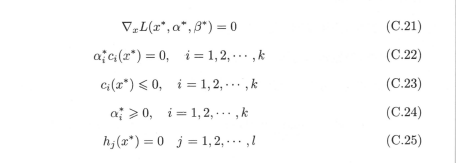

# 原始问题

假设$f(x),c_i(x),h_j(x)$是定义在$R^n$上连续可微函数，最优化问题

$$
\begin{aligned}
\begin{aligned}
\begin{aligned}
\begin{aligned}
\begin{aligned}
\min_{x\in R^n}\quad f(x)     \\
s.t \quad c_j\leq0,\quad i=1,2,\cdots,k     \\
h_j(x)=0,\quad j= 1,2,\cdots,l \tag{1}
\end{aligned}
\end{aligned}
\end{aligned}
\end{aligned}
\end{aligned}
$$

引入广义拉格朗日函数

$$
L(x,\alpha,\beta)=f(x)+\sum^k_{i=1}\alpha_ic_i(x)+\sum^l_{j=1}\beta_jh_j(x)
$$

其中，$\alpha_i,\beta_j$是拉格朗日乘子，$\alpha_i\geq 0$,考虑$x$的函数：

$$
\theta_p(x)\quad=\max_{\alpha,\beta:\alpha_i\geq0}\quad L(x,\alpha,\beta)
$$

这里，下表P表示原始问题；假设给定某个x，如果违反原始问题的约束条件，就有

$$
\theta_p(x)\quad=\max_{\alpha,\beta:\alpha_i\geq0}\quad L(x,\alpha,\beta)=+\infty
$$

因为若某个i使约束$c_i(x)>0$,则可令$\alpha_i\rightarrow+\infty$,若某个j使$h_j(x)\neq 0$则可令$\beta_i\rightarrow+\infty$,而将其余的$\alpha_i,\beta_i$均设为0；因此

$$
\begin{aligned}
\begin{aligned}
\begin{aligned}
\begin{aligned}
\begin{aligned}
\theta_p(x)=\begin{cases}
f(x),x\text{满足原始问题约束}
+\infty,\text{其他}
\end{cases}
\end{aligned}
\end{aligned}
\end{aligned}
\end{aligned}
\end{aligned}
$$

因此考虑极小化问题

$$
\min_x\theta_p(x)=\min_x\,\max_{\alpha,\beta:\alpha_i\geq0}\,L(x,\alpha,\beta)
$$

他和（1）是等价的；问题$\min_x\,\max_{\alpha,\beta:\alpha_i\geq0}\,L(x,\alpha,\beta)$称为广义拉格朗日函数的极小极大问题，这样就把原始最优化问题表示为广义拉格朗日函数的极小极大值问题。为了方便定义原始问题的最优解

$$
p^*=\min_x\theta_p(x)
$$

称为原始问题的值；

# 对偶问题

定义

$$
\theta_D(\alpha,\beta) = \min_xL(x,\alpha,\beta)
$$

再考虑极大化$\theta_D(\alpha,\beta)$,即

$$
\max_{\alpha,\beta:\alpha\geq0}\theta_D(\alpha,\beta)= \max_{\alpha,\beta:\alpha\geq0}\min_xL(x,\alpha,\beta)
$$

称为广义拉格朗日函数的极大极小问题；

于是广义拉格朗日函数的极大极小问题表示为约束优化问题：

$$
\begin{aligned}
\begin{aligned}
\begin{aligned}
\begin{aligned}
\begin{aligned}
\max_{\alpha,\beta:\alpha\geq0}\theta_D(\alpha,\beta)= \max_{\alpha,\beta:\alpha\geq0}\min_xL(x,\alpha,\beta)     \\
& s.t. \alpha_i\geq0,i=1,2,\cdots,k    \\
\end{aligned}
\end{aligned}
\end{aligned}
\end{aligned}
\end{aligned}
$$

称为原始问题的对偶问题，定义对偶问题最优值

$$
d^*=\max_{\alpha,\beta:\alpha\geq0}\theta_D(\alpha,\beta)
$$

称为对偶问题的值；

# 原始问题和对偶问题的关系

- 若原始问题和对偶问题都有最优解，则$d^*\leq p^*$；

  - 推论：设$x^*,\alpha^*,\beta^*$分别为原始问题和对偶问题的可行解，并且$d^*=p^*$,则$x^*,\alpha^*,\beta^*$分别是原始问题和对偶问题的最优解；

- 假设$f(x),c_i(x)$是凸函数，$h_j(x)$是仿射函数；并且假设不等式约束$c_i(x)$是严格可行的(存在x，对所有的i有$c_i{(x)}\leq0$),则存在$x^*,\alpha^*,\beta^*$,使$x^*$是原始问题的解，$\alpha^*,\beta^*$是对偶问题的解，且
  $$
  p^*=d^*=L(x^*,\alpha^*,\beta^*)
  $$

- 假设$f(x),c_i(x)$是凸函数，$h_j(x)$是仿射函数；并且假设不等式约束$c_i(x)$是严格可行的,则存在$x^*,\alpha^*,\beta^*$分别是原始问题和对偶问题的解的充分必要条件是$x^*,\alpha^*,\beta^*$满足下面的（KKT）条件：

​			特别指出，式（c.22）称为KKT的对偶互补条件，由此条件可知：若$a_i^*>0$,则$c_i(x^*)=0$;

