> 统计学习方法系列笔记，支持向量机（SVM）的原理推导与学习总结

# 引言

支持向量机（support vector machines,SVM）是一种二分类模型；它的基本模型定义在特征空间上的间隔最大模型分类器，间隔最大使之区别于感知机；同时还可以使用核技巧，使它成为非线性支持向量机；SVM的学习策略就是间隔最大化，等价于正则化的合页函数最小化；支持向量机的学习算法就是求解凸二次规划的最优化算法；

由简至繁的模型分别为

- 线性可分支持向量机--硬间隔最大化
- 线性支持向量机--软间隔最大化
- 非线性支持向量机--核技巧+软间隔最大化

# 线性可分支持向量机

线性可分支持向量机、线性支持向量机假设输入空间和特征空间的元素一一对应，并将输入空间中的输入映射为特征空间中的特征向量；支持向量机的学习实在特征空间内进行的；

假设训练数据集是线性可分的，且对于样本点$(x_i,y_i)$,当$y_i=+1$时$x_i$为正例；当$y_i=-1$时$x_i$为负例；

学习的目标是找到分离超平面$w\cdot x+b=0,\quad w$是法向量，$b$为截距，法向量指向的是正类；一般的，训练数据集线性可分时存在无穷多个分离超平面将两类数据正确划分。感知机利用误分类最小策略，求得分离超平面；线性可分支持向量机利用间隔最大化求最优分离超平面；

**定义**：（线性可分支持向量机）给定线性可分数据集，通过间隔最大化或等价的求解相应的凸二次规划问题学习得到的分离超平面为

$$
w^*\cdot x+b^*=0
$$

相应的决策函数为

$$
f(x)=sign(w^*\cdot x+b^*)
$$

## 函数间隔和几何间隔

**定义**：

> (函数间隔)给定训练数据集$T$和超平面$(w,b)$,关于样本点$(x_i,y_i)$的函数间隔为
>
> $$
> \hat\gamma_i=y_i(w\cdot x_i+b)
> $$
>
> 定义超平面$(w,b)$关于训练数据集$T$的函数间隔为超平面$(w,b)$关于$T$中所有样本点$(x_i,y_i)$的函数间隔最小值，
>
> $$
> \hat \gamma= \min_{i=1,\cdots,N}\hat \gamma_i
> $$

函数间隔可以表示分类预测的正确性及确信度，但是选择分离超平面时，只有函数间隔是不够的；如果成比例改变w和b，超平面没有改变但是间隔却变为原来的两倍；

因此我们可以对分离超平面的法向量加某些约束，如规范化，$||w||=1$,使得间隔是确定的，这时函数间隔为几何间隔

$$
\gamma_i=\frac w{||w||}\cdot x_i+\frac b{||w||}
$$

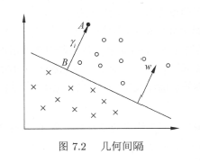

定义

> （几何间隔）对于给定的训练数据集$T$和超平面$(w,b)$,定义超平面$(w,b)$关于样本点$(x_i,y_i)$的几何间隔为
>
> $$
> \gamma_i=y_i(\frac w{||w||}\cdot x_i+\frac b{||w||})
> $$
>
> 定义超平面$(w,b)$关于训练数据集$T$的函数间隔为超平面$(w,b)$关于$T$中所有样本点$(x_i,y_i)$的函数间隔最小值，
>
> $$
> \gamma= \min_{i=1,\cdots,N} \gamma_i
> $$

超平面$(w,b)$关于样本点$(x_i,y_i)$的几何间隔一般是实例点到朝平面的带符号距离，正确分类时就是实例点到超平面的距离；

函数间隔和几何间隔有如下关系

$$
\begin{aligned}
\gamma_i=\frac{\hat \gamma_i}{||w||}
\gamma=\frac{\hat \gamma}{||w||}
\end{aligned}
$$

如果$||w||=1$,那么函数间隔和几何间隔相等；

## (硬)间隔最大化

支持向量机的基本想法是求解能够正确划分训练数据集并且几何间隔最大的分离超平面。间隔最大化的分离超平面是唯一的，这里的间隔最大化指硬间隔最大化;

间隔最大化最直观的表现对训练数据集找到几何间隔最大的超平面就意味着要以充分大的确信度对数据进行分类；

### 最大间隔分离超平面

求解间隔最大的分离超平面，可以表示为下面的最优化约束问题：

$$
\begin{aligned}
\max_{w,b} \gamma     \\
& s.t. \quad y_i(\frac {\hat w}{||w||}\cdot x_i + \frac b{||w||})\geq\gamma,\quad i = 1,2,\cdots,N    \\

\end{aligned}
$$

表示我们希望最大化超平面$(w,b)$关于训练数据的几何间隔$\gamma$,约束条件表示的超平面$(w,b)$关于每个训练样本点的集合间隔至少$\gamma$;

参考之前集合间隔和函数间隔的关系式，可以将其改写为

$$
\begin{aligned}
\max_{w,b}\frac{\hat \gamma}{||w||}
& s.t. \quad y_i(w\cdot x_i + b)\geq \hat \gamma_i,\quad i=1,2,\cdots,N    \\

\end{aligned}
$$

由于等比例的改变$w,b,\gamma$也会成比例的变化因此他是一个等价的问题；可以取$\hat \gamma=1$,而且注意最大化$\frac1{||w||}$和最小化$\frac12||w||^2$是等价的，于是就得到了下面的线性可分支持向量机的最优化问题：

$$
\begin{aligned}
\min_{w,b}\quad \frac12||w||^2     \\
& s.t.\quad y_i(w\cdot x_i + b)-1\geq0,\quad i=1,2,\cdots,N    \\

\end{aligned}
$$

这是一个凸二次规划问题；

> 凸优化问题是指约束最优化问题
>
> $$
> \begin{aligned}
> \begin{aligned}
> \begin{aligned}
> \min_wf(w)   \\
> & s.t.\quad g_i(w)\leq0,\quad i=1,2,\cdots,k   \\
> h_i(w)=1,\quad i=1,2,\cdots,l  \\
> \end{aligned}
> \end{aligned}
> \end{aligned}
> $$
>
> 其中，目标函数$f(w)$和约束函数$g_i(w)$都是$R^n$上的连续可微的凸函数，约束函数$h_i(w)$是$R^n$上的仿射函数。（$f(x)$称为仿射函数，如果它满足$f(x)=a\cdot x + b,a\in R^n,b\in R^n,x \in R^n$）

当目标函数$f(w)$是二次函数且约束函数$g_i(w)$是仿射函数时，上述最优化问题变成凸二次规划问题；如果求解出了最优化问题的解$w^*,b^*$,那么就可以得到最大间隔分离超平面$w^*\cdot x+ b^*=0$及分类决策函数$f(x)=sign(w^*+b^*)$，即线性可分支持向量机；

### 线性可分支持向量机-最大间隔法-算法

线性可分支持向量机学习算法—最大间隔法

1. 构造并求解约束最优化问题

$$
\begin{aligned}
\min_{w,b}\quad \frac12||w||^2\\      \\
& s.t.\quad y_i(w\cdot x_i+b)-1\geq0,\quad i=1,2,\cdots,N \tag{1}

\end{aligned}
$$

    并求得最优解$w^*,b^*$;

2. 由此得到的分离超平面：

$$
w^*\cdot x + b^*=0
$$

    分类决策函数

$$
f(x)=sign(w^*\cdot x+b^*)
$$

**线性可分训练数据集的最大间隔分离朝平面存在唯一的**；

### 支持向量和间隔边界

线性可分的情况下，训练数据集的样本点中与分离超平面距离最近的样本点的实例称为支持向量（support vector）,支持向量是使

$$
y_i(w\cdot x_i+b)-1=0
$$

对$y_i=+1$的正例点，支持向量在超平面$H_1:w\cdot x +b =1$;

对$y_i=-1$的正例点，支持向量在超平面$H_2:w\cdot x +b =-1$;

其中$H_1,H_2$上的点就是支持向量；

注意到$H_1,H_2$平行，没有实例点落在他们中间，它们之间的距离称为间隔，间隔依赖于分离超平面的法向量$w$,等于$\frac2{||w||}$,$H_1,H_2$为间隔边界；**分离超平面只有支持向量起作用，而其他实例点不会影响分离超平面；由于支持向量在确定分离超平面起到决定性的作用，因此这种分类模型叫做支持向量机，支持向量的个数一般很少，所以支持向量由”很少的重要的“训练样本确定；**（支持向量机的命名）

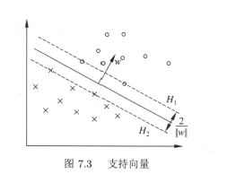

### 学习的对偶算法

求解线性可分支持向量机的最优化问题(1)可以作为原始最优化问题，应用拉格朗日对偶性可以通过求解对偶问题来得到原始问题的最优解；对偶问题往往更容易求解，而且自然的引入核函数，以便于推广到非线性问题；

首先构建拉格朗日函数，对于每一个约束条件引入拉格朗日乘子**$a_i\geq0,i=1,2,\cdots,N$（这个将用于后面重新从另一个角度阐述支持向量的关键，注意这个条件）**，则：

$$
L(w,b,\alpha)=\frac12||w||^2-\sum\limits^N_{i=1}a_iy_i(w\cdot x_i+b)+\sum^N_{i=1}\alpha_i
$$

根据拉格朗日对偶性，原始问题的对偶问题是极大极小问题：

$$
\max_\alpha\,\min_{w,b}L(w,b,\alpha)
$$

1. 求$\min\limits_{w,b}L(w,b,\alpha)$，将拉格朗日函数$L(w,b,\alpha)$分别对$w,b$,求偏导数并且令其等于0；

   $$
   \begin{aligned}
   \begin{aligned}
   \nabla_wL(w,b,\alpha)=w-\sum^N_{i=1}a_iy_ix_i = 0  \\
   \nabla_bL(w,b,\alpha)=-\sum^N_{i=1}a_iy_i=0 \\
   \end{aligned}
   \end{aligned}
   $$

   得

   $$
   \begin{aligned}
   \begin{aligned}
   w=\sum^N_{i=1}\alpha_iy_ix_i  \\
   \sum^N_{i=1}\alpha_iy_i=0 \\
   \end{aligned}
   \end{aligned}
   $$

   将结论带入拉格朗日函数,得到

   $$
   \begin{aligned}
   \begin{aligned}
   L(w,b,\alpha)=\frac12\sum^N_{i=1}\sum^N_{j=1}a_ia_jy_iy_j(x_i\cdot x_j)-\sum^N_{i=1}a_iy_i((\sum^N_{j=1}\alpha_jy_jx_j)\cdot x_i+b)+\sum^N_{i=1}\alpha_i  \\
   =\frac12\sum^N_{i=1}\sum^N_{j=1}a_ia_jy_iy_j(x_i\cdot x_j)-\sum^N_{i=1}\sum^N_{j=1}a_ia_jy_iy_jx_ix_j-b\sum^N_{i=1}a_iy_i+\sum^N_{i=1}\alpha_i  \\
   =-\frac12\sum^N_{i=1}\sum^N_{j=1}a_ia_jy_iy_j(x_i\cdot x_j)+\sum^N_{i=1}\alpha_i \\
   \end{aligned}
   \end{aligned}
   $$

   因此求解

   $$
   \min_{w,b}L(w,b,\alpha)=-\frac12\sum^N_{i=1}\sum^N_{j=1}a_ia_jy_iy_j(x_i\cdot x_j)+\sum^N_{i=1}\alpha_i
   $$
2. 对$\min_{w,b}L(w,b,\alpha)$对$\alpha$的极大，即是对偶问题

   $$
   \begin{aligned}
   \begin{aligned}
   \max_\alpha-\frac12\sum^N_{i=1}\sum^N_{j=1}\alpha_i\alpha_jy_iy_j(x_i\cdot x_j)+\sum^N_{i=1}\alpha_i  \\
   & s.t.\quad\sum^N_{i=1}\alpha_iy_i=0,  \\
   \alpha_i\geq0,\,i=1,2,\cdots,N \\
   \end{aligned}
   \end{aligned}
   $$

**原始问题满足拉格朗日对偶性中末尾第二个定理的条件，所以存在$w^*,\alpha^*,\beta^*$,使得$w^*$是原始问题的解，$\alpha^*,\beta^*$是对偶问题的解；这就意味着几乎等价的将原始问题转化为对偶问题；**(巧妙~~)

---

对线性可分训练数据集，假设对偶最优化问题对$\alpha$的解为$\alpha^*=(a^*_1,a^*_2,\cdots,a^*_N)^T$,可以有$\alpha^*$求得原始最优化问题的解$w^*,b^*$;i

**定理：** 设$\alpha^*$是对偶最优化问题的解，则存在下表$j$,使得$a^*_j>0$,且

$$
\begin{aligned}
w^*=\sum^N_{i=1}\alpha^*_iy_ix_i     \\
b^*=y_j-\sum^N_{i=1}\alpha^*_iy_i(x_i\cdot x_j)    \\

\end{aligned}
$$

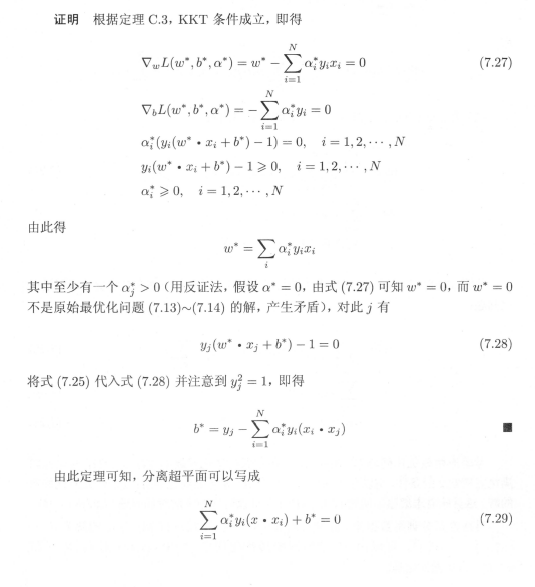

    分类决策函数可以写成

$$
f(x)=sign(\sum^N_{i=1}\alpha^*_iy_ix\cdot x_i+b^*)
$$

也就是说分裂决策函数只依赖于输入x和训练样本输入的内积；上式称为线性可分支持向量机的对偶形式；

**综上所述，对于给定的线性可分训练数据集，可以先求对偶问题的解$\alpha^*$在根据定理求解原始问题的$w^*,b^*$;从而得到分离超平面及分类决策函数；这种算法称为线性可分支持向量机的对偶学习算法，是线性可分支持向量机的基本算法；**

### 线性可分支持向量机学习算法

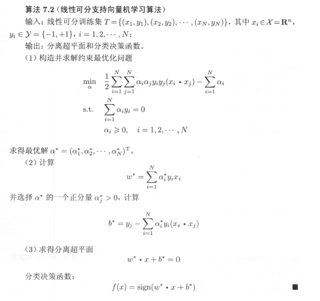

线性可分支持向量机中，$w^*,b^*$只依赖于训练数据中对应于$\alpha^*_i>0$的样本点$(x_i,y_i)$,而其他样本点对$w^*,b^*$没有影响我们将训练数据中对应于$\alpha^*_i>0$的实例点$x_i\in R^n$称为支持向量；

**定义：（支持向量）** 考虑最优化问题和对偶最优化问题，将训练数据集中对应于$\alpha^*_i>0$的样本点$(x_i,y_i)$的实例$x_i\in R^n$称为支持向量；

根据这一定义支持向量一定在间隔边界上，由KKT互补条件可知，

$$
a^*_i(y_i(w^*\cdot x_i+b^*)-1)=0,\quad i=1,2,\cdots,N
$$

对应于$a^*_i>0$的实例$x_i$,有

$$
\begin{aligned}
y_i(w^*\cdot x_i+b^*)-1=0     \\
w^*\cdot x_i+b^*=\pm1    \\

\end{aligned}
$$

即$x_i$一定在间隔边界上。这里支持向量的定义与前面给出支持向量是一致的；

# 线性支持向量机与软间隔最大化

## 线性支持向量机

> 线性可分的问题的支持向量学习方法，对线性不可分的训练数据是不适用的，因为这时上述方法的不等式约束并不都能成立。这就需要修改硬间隔最大化为软间隔最大化；

线性不可分就意味着某些样本点$(x_i,y_i)$不能满足函数间隔大于等于1的约束条件。为了解决这个问题可以对每个样本点$(x_i,y_i)$引入一个松弛变量$\xi_i\geq0$,使函数间隔加上松弛变量大于等于1，这样约束条件为

$$
y_i(w\cdot x_i +b)\geq 1-\xi _i
$$

同时，对每个松弛变量$\xi_i$，支付一个代价$\xi_i$,目标函数有原来的$\frac12||w||^2$变成

$$
\frac12||w||^2+C\sum^N_{i=1}\xi_i
$$

这里，$C>0$称为惩罚参数，一般根据实际问题决定，*C*值的大小决定了对误分类的惩罚大小；最小化目标函数包含两层含义：使$\frac12||w||^2$尽量小（间隔尽量大），同时误分类点个数尽量小，*C*是用来调和二者的系数；

利用此思路，可以和训练数据线性可分时一样来考虑数据集线性不可分时的线性支持向量机学习问题，称为软间隔最大化；线性不可分的的线性支持向量机学习问题变成了如下凸二次规划问题:

$$
\begin{aligned}
\min_{w,b,\xi}\frac12||w||^2+C\sum^N_{i=1}\xi_i     \\
& s.t.\quad y_i(w\cdot x_i+b)\geq1-\xi_i,\quad i=1,2,\cdots,N     \\
\xi_i\geq,\quad i=1,2,\cdots,N    \\

\end{aligned}
$$

可以证明*w*是唯一的，但*b*的解可能不唯一，而是存在一个区间；

**定义（线性支持向量机）：** 对于给定的线性不可分的训练数据集，通过求解凸二次规划问题，即软间隔最大化问题，得到分离超平面为

$$
w^*\cdot x+b^*=0
$$

以及相应的分类决策函数

$$
f(x)=sign(w^*\cdot x+b^*)
$$

称为线性支持向量机；

## 学习的对偶算法

原始最优化问题的拉格朗日函数是

$$
L(w,b,\xi,\alpha,\mu)=\frac12||w||^2+C\sum^N_{i=1}\xi_i-\sum^N_{i=1}\alpha_i(y_i(w\cdot x_i+b)-1+\xi_i)-\sum^N_{i=1}\mu_i\xi_i
$$

其中，$\alpha_i\geq0,\mu_i\geq0$,对偶问题是拉格朗日极大极小问题，首先对$L(w,b,\xi,\alpha,\mu)$对$w,b,\xi$的极小，由

$$
\begin{aligned}
\nabla_wL(w,b,\xi,\alpha,\mu)=w-\sum^N_{i=1}\alpha_iy_ix_i=0     \\
\nabla_bL(w,b,\xi,\alpha,\mu)=-\sum^N_{i=1}\alpha_iy_i=0     \\
\nabla_{\xi_i}L(w,b,\xi,\alpha,\mu)=C-\alpha_i-\mu_i=0    \\

\end{aligned}
$$

得到

$$
\begin{aligned}
w=\sum^N_{i-1}\alpha_iy_ix_i     \\
\sum^N_{i=1}\alpha_iy_i=0     \\
C-\alpha_i-\mu_i=0    \\

\end{aligned}
$$

将其带入得到

$$
\min_{w,b,\xi}L(w,b,\xi,\alpha,\mu)=-\frac12\sum^N_{i=1}\sum^N_{j=1}\alpha_i\alpha_jy_iy_j(x_i\cdot x_j)+\sum^N_{i=1}\alpha_i
$$

再对$\min \limits_{w,b,\xi}\,L(w,b,\xi,\alpha,\mu)$求$\alpha$的极大，即得对偶问题；

$$
\begin{aligned}
\max_\alpha-\frac12\sum^N_{i=1}\sum^N_{j=1}\alpha_i\alpha_jy_iy_j(x_i\cdot x_j)+\sum^N_{i=1}\alpha_i     \\
& s.t.\quad\sum^N_{i=1}\alpha_iy_i=0     \\
C-\alpha_i-\mu_i=0     \\
\alpha_i\geq0     \\
\mu_i\geq 0 ,\quad i=1,2,\cdots,N    \\

\end{aligned}
$$

可以将其转化为

$$
\begin{aligned}
\min_\alpha \frac12\sum^N_{i=1}\sum^N_{j=1}\alpha_i\alpha_jy_iy_j(x_i\cdot x_j)-\sum^N_{i=1}\alpha_i     \\
& s.t.\quad \sum^N_{i=1}\alpha_iy_i=0     \\
0\leq\alpha_i\leq C,\quad i=1,2,\cdots,N    \\

\end{aligned}
$$

**定理：**设$\alpha^*$是对偶问题的一个解，若存在$\alpha^*$的一个分量$\alpha^*,0<\alpha^*_j<C$,则原始问题的解$w^*,b^*$,可以按照下式：

$$
\begin{aligned}
w^*=\sum^N_{i=1}\alpha^*_iy_ix_i     \\
b^*=y_j-\sum^N_{i=1}y_i\alpha^*_i(x_i\cdot x_j)    \\

\end{aligned}
$$

证明:

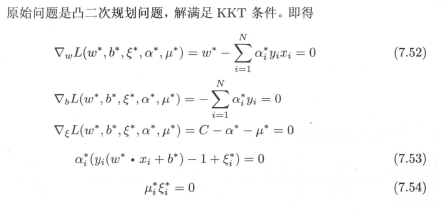

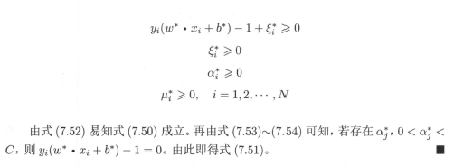

由此可知，分离超平面

$$
\sum^N_{i=1}\alpha^*_iy_i(x\cdot x_i)+b^*=0
$$

分类决策函数可以写成

$$
f(x)=sign(\sum^N_{i=1}\alpha^*_iy_i(x\cdot x_i)+b^*)
$$

## 算法

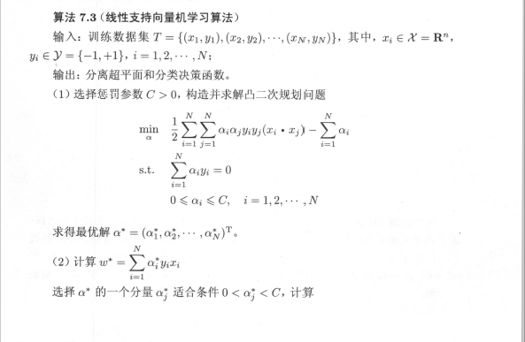

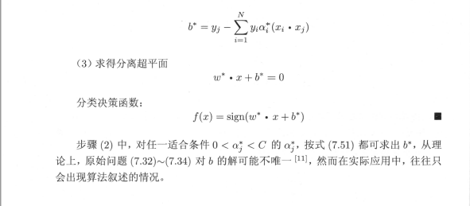

## 支持向量

在线性不可分的情况下，将对偶问题的解$\alpha^*$中对应于$\alpha^*_i>0$的样本点$(x_i,y_i)$的实例$x_i$称为支持向量（软间隔的支持向量）。如图

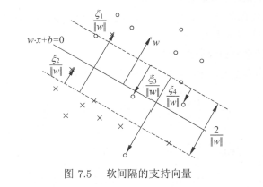

软间隔的支持向量在间隔边界或者分离超平面之间，

- 若$\alpha^*_i<C$,则$\xi_i=0$,支持向量恰好落在间隔边界上
- 若$\alpha^*_i=C,0<\xi_i<1,$则分类正确，实例落在间隔边界与分离超平面之间
- 若$\alpha^*_i=C,\xi_i=1$,则实例在分离超平面上
- 若$\alpha^*_i=C,\xi_i>1$,则实例点位于分离超平面误分的一侧

## 合页损失函数

线性可分支持向量机学习还有另外一种解释，就是最小化以下目标函数

$$
\sum^N_{i=1}[1-y_i(w\cdot x_i+b)]_++\lambda||w||^2
$$

目标函数的第一项是经验损失或经验风险，函数

$$
L(y(w\cdot x+b))=[1-y(w\cdot x+b)]_+
$$

称为合页损失函数(hinge loss function)。下标“+”表示一下取正值的函数

$$
\begin{aligned}
[z]_+=\begin{cases}
z,z>0     \\
0,z\leq0     \\
\end{cases}

\end{aligned}
$$

这就是说，当样本点$(x_i,y_i)$被正确分类且间隔（置信度）$y_i(w\cdot x_i+b)$大于1时，损失是0，否则损失是$1-y_i(w\cdot x_i+b)$.注意到其中有正确分类但损失不是0.目标函数的第二项是函数$\lambda$的w的$L_2$范数，是正则化项；

**定理：** 线性支持向量机的原始最优化问题

$$
\begin{aligned}
\min_{w,b,\xi}\frac12||w||^2+C\sum^N_{i=1}\xi     \\
& s.t.\quad y_i(w\cdot x_i +b)\geq1-\xi,\quad i=1,2,\cdots,N     \\
\xi_i\geq0,\quad i=1,2,\cdots,N\tag{1,2,3}

\end{aligned}
$$

等价于最优化问题

$$
\min_{w,b}\sum^N_{i=1}[1-y_i(w\cdot x_i+b)]_++\lambda||w||^2
$$

**证明:**可以将上面两个式子进行改写，令

$$
[1-y_i(w\cdot x_i+b)]_+=\xi_i
$$

- 由合页函数定义知$\xi_i\geq0$成立
- 当$1-y_i(w\cdot x_i+b)>0$时，有$1-y_i(w\cdot x_i)=1-\xi_i$
- 当$q-y_i(w\cdot x_i+b)\leq0$时，$\xi_i=0$,有$y_i(w\cdot x_i+b)\geq1-\xi_i$

于是，满足约束条件故最优化问题可以写为

$$
\min_{w,b}\sum^N_{i=1}\xi_i+\lambda||w||^2
$$

若取$\lambda=\frac1{2C}$,则

$$
\min_{w,b}\frac1C(\frac12||w||^2+C\sum^N_{i=1}\xi_i)
$$

---

依据下图来做一个简单的总结

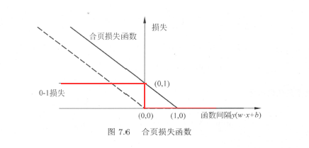

- 0-1损失函数可以认为是二分类问题的真正损失函数，而合页损失函数是其上界；由于0-1损失函数不是连续可导的，直接优化目标函数比较困难，可以认为线性支持向量机是由优化0-1损失函数的上界（合页损失函数）构成的目标函数。此上界又称为代理损失函数；
- 图中虚线显示的是感知机的损失函数$[-y_i(w\cdot x_i+b)]_+$,当样本点被正确分类时，损失为0，否则损失为$-y_i(w\cdot x_i+b)$相比之下，**合页损失函数不仅要求分类正确，而且确信度足够高时损失才是0，合页损失函数有更高的要求**；

# 非线性支持向量机与核函数

> 这里介绍说的非线性支持向量机主要特点是利用核技巧（kernel trick），因此会介绍核技巧，其不仅用于支持向量机也用于其他统计学习问题；

## 核技巧

一般来说，对给定的一个训练数据集如果一个超曲面能够将正负例正确分开，但可以用一条椭圆曲线（非线性模型）将其分开，则称这个问题为非线性可分问题；

我们所采取的方法是进行一个非线性变换，将非线性问题变换为线性问题，通过解变换后的线性问题求解原来的非线性问题。通过变换将作图中的椭圆变换成右图中的直线，将非线性问题变换为线性可分类问题；（巧妙）

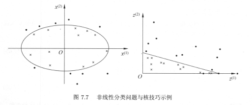

根据上图，用线性分类方法求解线性分类问题可以分成两部

- 使用一个变换将空间中的数据映射到新的空间中
- 然后再新的空间中使用线性分类学习方法从训练数据中学习分类模型

核技巧就是这样的方法，核技巧应用支持向量机基本想法是通过一个非线性变换将输入空间（欧式空间$R^b$或离散集合）对应于一个特征空间（西伯尔特空间），使得在输入空间中的超曲面模型对应于特征空间中的超平面模型。这样，分类问题的学习任务通过在特征空间中求解线性支持向量机来完成；

**核函数的定义**:设输入空间$\chi$，特征空间$H$,如果存在一个映射

$$
\phi(x):\chi\rightarrow H
$$

使得对所有的$x,z\in\chi,$函数$K(x,z)$满足条件

$$
K(x,z)=\phi(x)\cdot\phi(z)
$$

则称$K(x,z)$为核函数，$\phi(x)$为映射函数，核函数为映射函数的内积；

核技巧的想法是，在学习与预测中只定义核函数，而不显示的定义映射函数，通常直接定义$K(x,z)$比较容易，而通过映射函数计算核函数并不容易特征；注意,**$\phi$**是输入空间到特征空间的映射，特征空间一般是高维的，甚至是无穷维的，可以看到对给定的核$K(x,z)$,特征空间和映射函数的取法不唯一，甚至在同意特征空间内也可以取不同的映射；

## 核技巧在支持向量中的应用

> 注意到线性支持向量机的对偶问题中，无论是目标函数还是决策函数（分离超平面）都只涉及输入实例与实例之间的内积。在对偶问题的目标函数中的内积$x_i\cdot x_j$,可以用核函数$K(x_i,x_j)$来代替。

此时对偶问题的目标函数为

$$
W(\alpha)=\frac12\sum^N_{i=1}\sum^N_{j=1}\alpha_i\alpha_jy_iy_jK(x_i,x_j)-\sum^N_{i=1}\alpha_i
$$

同样分类决策函数中的内积也可以用核函数代替，因为分类决策函数为

$$
\begin{aligned}
f(x)=sign(\sum^{N_s}_{i=1}\alpha^*_iy_i\phi(x_i)\cdot\phi(x)+b^*)     \\
=sign(\sum^{N_S}_{i=1}\alpha^*_iy_iK(x_i,x)+b^*)    \\

\end{aligned}
$$

这等价于经过映射函数$\phi$将原来的输入空间转换到一个新的特征空间，将输入空间中的内积$x_i,x_j$,变换为特征空间中的内积$\phi(x_i)\cdot\phi(y)$,在新的特征空间中训练样本中学习线性支持向量机，当映射函数是非线性函数时，学习到的含有核函数的支持向量机是非线性分类模型；

在核函数给定的条件下可以利用求解线性分类问题的方法求解非线性分类问题；学习是隐式的在特征空间中进行的，不需要显式定义特征空间和映射函数。这称为核技巧；在实际应用中，往往依赖领域知识直接选择核函数，核函数的选择的有效性需要通过实验验证；

## 正定核

不构造映射$\phi(x)$能否判断一个给定的函数$K(x,z)$是不是核函数？函数$K(x,z)$满足什么条件才能成为核函数？

这里叙述正定核的充要条件，通常所说的核函数就是正定核函数（positive definite kernel function)；

> 假设$K(x,z)$是定义在$\chi * \chi$上的对称函数，并且对任意的$x_1,x_2,\cdots,x_m\in\chi ,K(x,z)$关于$x_1,x_2,\cdots,x_m$的Gram矩阵是半正定的，可以依据函数$K(x,z)$,构成一个希尔伯特空间，其步骤为
>
> - 先定义映射函数$\phi$并构成向量空间*S*;
> - 然后再*S*空间上定义内积构成内积空间；
> - 最后*S*完备化构成希尔伯特空间

1. 定义映射,构成向量空间*S*

   先定义映射

   $$
   \phi:x\rightarrow K(\cdot,x)
   $$

   根据这一映射，对任意$x_i\in\chi,\alpha_i\in R,i=1,2,\cdots,m$,定义线性组合

   $$
   f(\cdot)=\sum^M_{i=1}\alpha_iK(\cdot,x_i)
   $$

   考虑线性组合为元素的集合$S$,由于集合$S$对加法和乘法运算是封闭的，所以*S*构成一个向量空间；
2. 在*S*上定义内积，使之称为内积空间

   在S上定义运算$*$；对任意$f,g\in S$,

   $$
   \begin{aligned}
   \begin{aligned}
   f(\cdot)=\sum^M_{i=1}\alpha_iK(\cdot,x_i)  \\
   g(\cdot)=\sum^l_{j=1}\beta_jK(\cdot,z_i) \\
   \end{aligned}
   \end{aligned}
   $$

   定义运算$*$

   $$
   f*g=\sum^M_{i=1}\sum^L_{j=1}\alpha_i\beta_jK(x_i,z_j)
   $$

   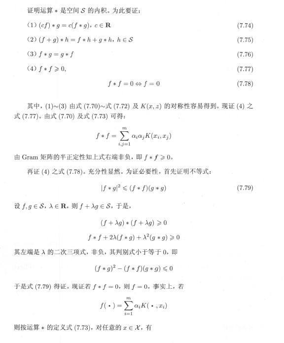

   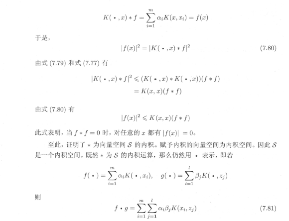
3. 将内积空间$S$完备化为希尔伯特空间

   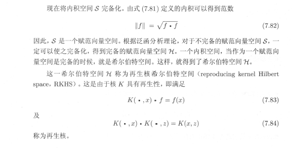
4. **正定核的充要条件** 设$K:\chi * \chi\rightarrow R$是对称函数，则$K(x,z)$为正定核函数的充要条件是对任意的$x_i\in \chi,i=1,2,\cdots,m,K(x,z)$对应的Gram矩阵：

   $$
   K=[K(x_i,x_j)]_{m*m}
   $$

   是半正定的；

   **定义：（正定核的等价定义)**: 设$\chi\subset R^n,K(x,z)$是定义在$\chi*\chi$上的对称函数，对任意的$x_i\in \chi,i=1,2,\cdots,m,K(x,z)$对应的Gram矩阵

   $$
   K=[K(x_i,x_j)]_{m*m}
   $$

   是半正定矩阵，则称$K(x,z)$是正定核；

   **此定义在构造核函数时候很有用，但对于一个具体的核函数来说验证它是否为正定核是不容易的，因为要求对任意有限输入集$\{x_1,x_2,\cdots,x_m\}$验证*K*对应的Gram矩阵是否为半正定的。实际问题中往往应用已有的核函数。另外，由Mercer定理可以得到Mercer核，正定核比Mercer更具一般性**；

## 常用核函数

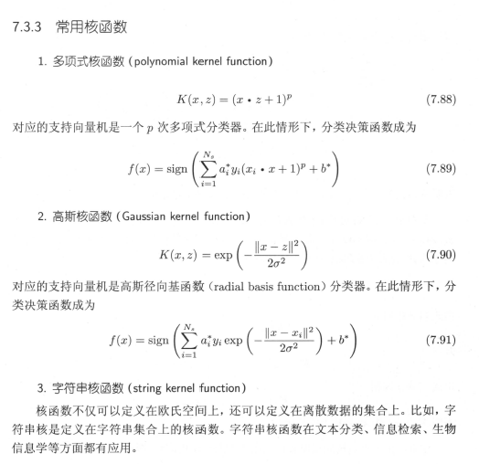

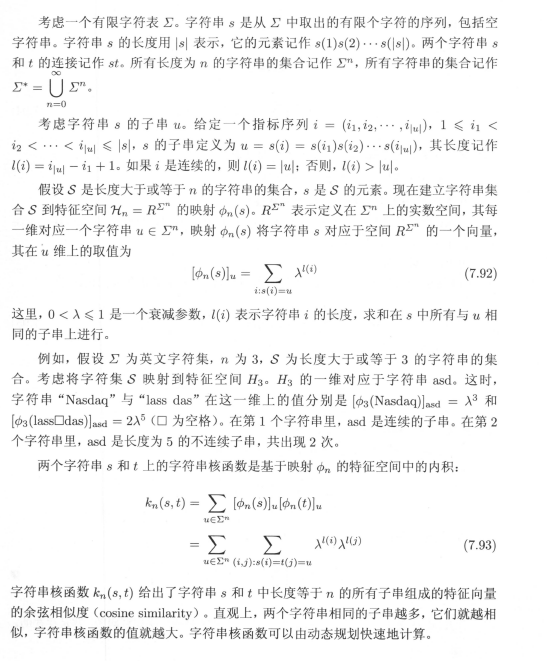

## 非线性支持向量分类机（141）

待更新。。。。
