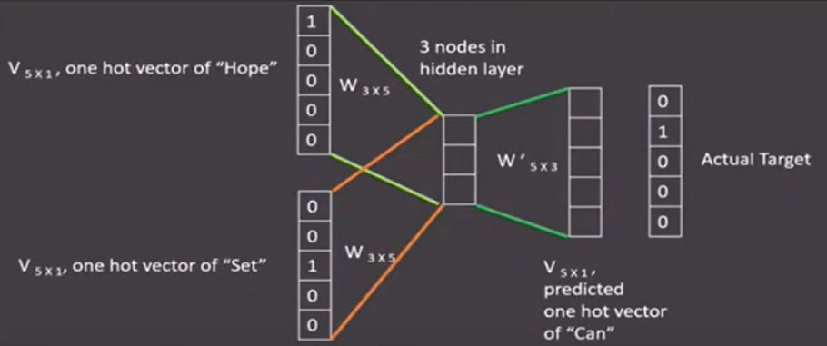

# Text To Vector

## one-hot vector

- 优势

- - 操作简单容易理解

- 劣势

- - 完全割裂词与词之间的连续
  - 大语料下向量长度过大，造成维度爆炸

```python
# tokenizer
from sklearn.externals import joblib
from keras.preprocessing.text import Tokenizer
vocab = {'词汇1','词汇2','词汇3'}
t = Tokenizer(num_words=None,char_level=False)
t.fit_on_texts(vocab)

for token in vocab:
    zero_list = [0]*len(vocab)
    token_index = t.texts_to_sequences([token])[0][0]-1
    zero_list[token_index] = 1
    print(token,'的one-hot编码为：',zero_list)
    
# 使用joblib工具保存映射器，以便于之后使用
tokenizer_path = './Tokenizer'
joblib.dump(t,tokenizer_path)

# 装载并使用
form sklearn.externals import joblib
t = joblib.load(tokenizer_path)

token = '词汇1'
token_index = t.texts_to_sequences([token])[0][0] - 1
zero_list = [0]*len(vocab)
zero_list[token_index] = 1
print(token,'的one-hot编码为：',zero_list)
```

## word Embedding

- 通过一定方式将词汇从高维空间映射到低维空间
- 广义的word embedding包括所有密集词汇向量的表示方法
- 狭义的word embedding指在神经网络中加入embedding层，对整个网络训练的同时产生embedding矩阵，这个矩阵就是训练过程中所有词汇的向量表示组成的矩阵；

## word2vec

> 将构建神经网络模型，使用一种无监督的形式，将网络参数作为词汇的向量表示，包含CBOW（continuous bag of words）和skip-gram两种训练模式；

### CBOW

设定的滑动窗口，每轮训练根据滑动窗口大小利用周围词的one-hot表示来做输入，中间词的one-hot表示做输出，随后滑动窗口向前滑动，直到语料被完全遍历；

最后隐层矩阵就是该词汇的word2vec张量表示；



### skip-gram

skip-gram与word2vec相反，设定滑动窗口，将中间词汇的one-hot向量作为输入，周围词汇的one-hot向量作为输出，随后滑动窗口，直到语料被完全遍历；

最后隐层矩阵就是该词汇的skip-gram张量表示；


### 实践

在获取到语料的基础上利用python的fasttext包;

超参数设定

- 实践中，skipgram模式在利用子词方面更好；默认使用skipgram；
- 默认嵌入为100维张量；
- 数据循环次数，默认为5次；

```python
import fasttext

# 训练
model = fasttext.train_unsupervised('data/fil9','skipgram',dim=100,epoch=5,lr=0.01,thread=8)

# 获得对应单词的词向量
model.get_word_vector('the')

model.get_nearest_neighbors('sports')

# 模型保存
model.save_model('fil9.bin')
# 模型装载
model.load_model('fil9.bin')
```

# 文本数据分析

- 目的

- - 帮助我们理解预料，检查出预料可能存在的问题
  - 指导训练过程中超参数的选择

- 常用的几种文本数据分析方法

- - 标签数量分布
  - 句子长度分布
  - 词频统计与关键词词云

> 在深度学习模型评估中，一般使用ACC作为评估标准，要想ACC基线定义在50%左右，则需要我们的正负样本比例维持在1:1左右，否则需要进行必要的数据增强或数据删减；