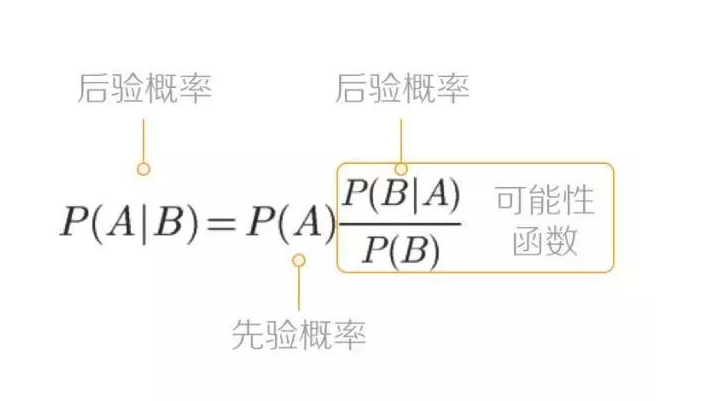
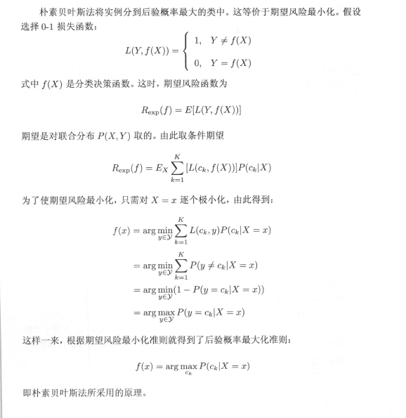

## 数学基础

先验概率： 根据以往的经验分析得到的概率；

后验概率：根据结果推导原因；

贝叶斯公式：

## 核心原理

朴素贝叶斯法通过训练数据集学习联合概率分布$P(X,Y)$，具体的学习先验概率分布

$$
P(Y=c_k),k=1,2,\cdots,K
$$

条件概率分布

$$
P(X=x|Y=c_k)=P(X^{(1)}=x^{(1)},\cdots,X^{(n)}=x^{(n)}|Y=c_k),k=1,2,\cdots,K
$$

于是学习到联合概率分布$P(X,Y)$

实际上，朴素贝叶斯对条件概率分布做了**条件独立性的假设**，这一假设使得朴素贝叶斯发相对简单；但也会**牺牲一定的分类准确率**；

---

朴素贝叶斯法分类时，对于给定的输入x，通过学习到的模型计算后验概率分布，将后验概率最大的类作为x的输出类。具体的朴素贝叶斯分类器可以表示为

$$
y=f(x)=arg\max\limits_{c_k} \frac{P(Y=c_k)\prod\limits_jP(X^{(j)}=x^{(j)}|Y=c_k)}{\sum_kP(Y=c_k)\prod\limits_jP(X^{(j)}=x^{(j)}|Y=c_k)}
$$

由于上式中所有分母都是相同的，因此上式等价于

$$
y=arg\max \limits_{c_k} P(Y=c_k)\prod\limits_jP(X^{(j)}=x^{(j)}|Y=c_k)
$$

---

**后验概率最大化等价于经验风险最小化**（后验概率最大化的含义）

## 朴素贝叶斯的参数估计

### 极大似然估计

1. 计算先验概率及条件概率
   $$
   P(Y=c_k)=\frac{\sum\limits_{i=1}^NI(y_i=c_k)}{N},k=1,2,\cdots,K
   $$

   $$
   P(X^{(j)}=a_{jl}|Y=c_k)=\frac{\sum\limits^N_{i=1}I(x_i^{(j)}=a_{jl},y_j=c_k)}{\sum\limits^N_{i=1}I(y_i=c_k)}
   $$

   $$
   j=1,2,\cdots,n;l=1,2,\cdots,S_j;k=1,2,\cdots,K
   $$

2. 对于给定的实例$x=(x^{(1)},x^{(2)},\cdots,x^{(n)})^T$,计算
   $$
   p(Y=c_k)\prod^n_{j=1}P(X^{(j)}=x^{(j)}|Y=c_k),k=1,2,\cdots,K
   $$

3. 确定实例x的类
   $$
   y=arg\max\limits_{c_k}P(Y=c_k)\prod\limits^n_{j=1}P(X^{j}=x^{j}|Y=c_k)
   $$

### 贝叶斯估计

极大似然估计可能会出现要估计的概率值为0的情况，这会影响到后验概率的计算结果。使分类产生偏差。可以用贝叶斯估计来解决这一问题；具体的

---

先验概率的贝叶斯估计是

$$
P_\lambda(Y=c_k)=\frac{\sum\limits_{i=1}^NI(y_i=c_k)+\lambda}{N+K\lambda}
$$

条件概率的贝叶斯估计是

$$
P\lambda(X^{(j)}=a_{jl}|Y=c_k)=\frac{\sum\limits^N_{i=1}I(x_i^{(j)}=a_{jl},y_i=c_k)+\lambda}{\sum\limits^{S_j}_{i=1}I(y_i=c_k)+S_j\lambda}
$$

---

其中，$\lambda\geq0$,相当于在随机变量各个取值上赋予一个整数$\lambda>0$.当$\lambda=0$时就是极大似然估计；常取$\lambda=1$,这时称为拉普拉斯平滑。显然

$$
P_\lambda(X^{(j)}=a_{jl}|Y=c_k)>0
$$

$$
\sum\limits^{S_j}_{j=1}P(X^{(j)}=a_{jl}|Y=c_k)=1
$$
